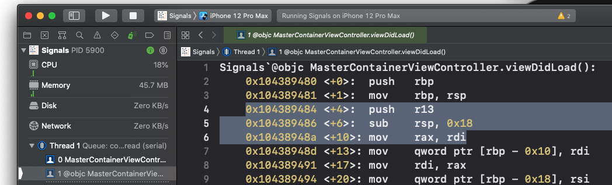
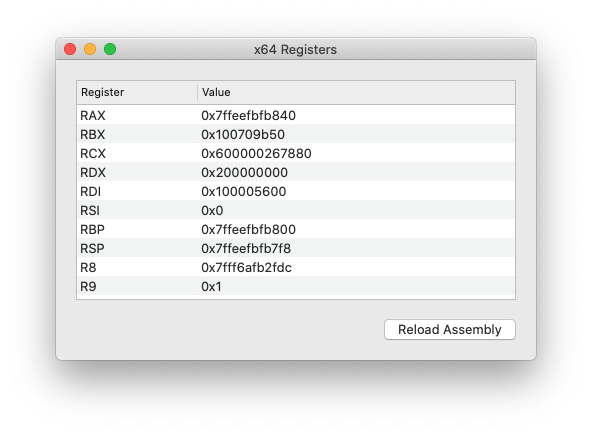
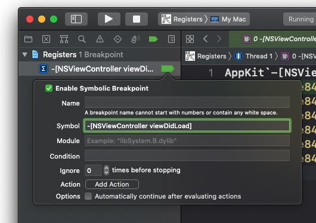
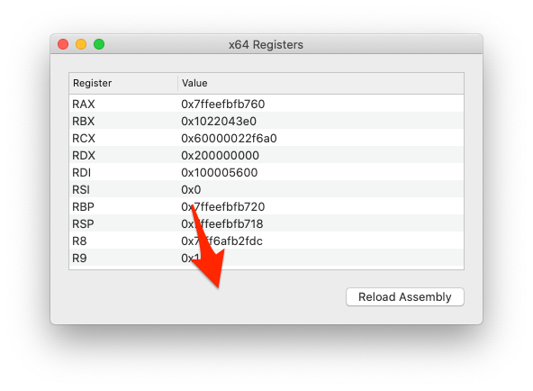
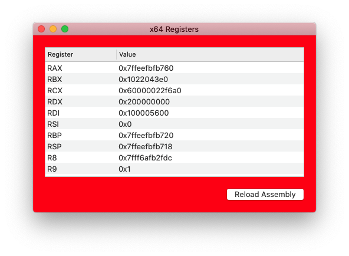
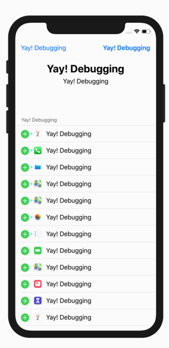

# Chapter 11

## Registers



`r13`, `rsp`, `rax`, `rdi` 는 레지스터를 의미한다. (Intel x86_64) 아래 Objective-C 코드의 경우

```objective-c
NSString *name = @"Zoltan";
NSLog(@"Hello world, I am %@. I'm %d, and I live in %@", name, 30, @"my father's basement");
```

여기서 arguements의 registers 이름은

- 첫번째 argument: `RDI`
- 두번째 argument: `RSI`
- 세번째 argument: `RDX`
- 네번째 argument: `RCX`
- 다섯번째 argument: `R8`
- 여섯번째 argument: `R9`

등등...

이러면 위 Objective-C 코드의 경우

```objective-c
RDI = @"Hello world, I am %@. I'm %d, and I live in %@";
RSI = @"Zoltan";
RDX = 30;
RCX = @"my father's basement";
NSLog(RDI, RSI, RDX, RCX);
```

이렇게 되겠다.

## Objective-C

Objective-C의 method를 실행할 때, `objc_msgSend`라고 하는 특별한 C function을 실행한다. argument로는 char *로 이뤄진 selector를 받는다. 만약 아래의 코드의 경우

```objective-c
[UIApplication sharedApplication];
```

컴파일러는 아래와 같은 코드를 생성한다.

```objective-c
id UIApplicaionClass = [UIApplication class];
objc_msgSend(UIApplicationClass, "sharedApplication");
```

다른 예시로는

```objective-c
NSString *helloWorldString = [@"Can't Sleep; " stringByAppendingString:@"Clowns will eat me"];
helloWorldString = objc_msgSend(@"")
```

컴파일러는 아래와 같은 코드를 생성한다.

```objective-c
NSString *helloWorldString;
helloWorldString = objc_msgSend(@"Can't Sleep;", "stringByAppendingString:", @"Clowns will eat me");
```

### Registers 연습 (1)

Registers 프로젝트를 열면 x64 registers들을 보여준다.



breakpoint를 설정하고 다시 실행하자.

```objective-c
-[NSViewController viewDidLoad]
```



그리고 lldb에 아래와 같이 입력하면 paused state의 main registers을 보여준다.

```
(lldb) register read
General Purpose Registers:
       rax = 0x000000010000d420  (void *)0x000000010000e0d8: _TtC9Registers14ViewController
       rbx = 0x000060000300c750
       rcx = 0x000060000300c750
       rdx = 0x0000000000000000
       rdi = 0x000060000300c750
       rsi = 0x00007fff759bd626  
       rbp = 0x00007ffeefbfe3e0
       rsp = 0x00007ffeefbfe3a8
        r8 = 0x0000000000000010
        r9 = 0x0000000000000000
       r10 = 0x0000000100000000  Registers`_mh_execute_header
       r11 = 0x000000010013d62e  libMainThreadChecker.dylib`__trampolines + 11970
       r12 = 0x000000010064a970
       r13 = 0x000060000300c750
       r14 = 0x0000000000000068
       r15 = 0x000000010064a970
       rip = 0x00007fff2e848296  AppKit`-[NSViewController viewDidLoad]
    rflags = 0x0000000000000216
        cs = 0x000000000000002b
        fs = 0x0000000000000000
        gs = 0x0000000000000000
```

아까 배운 내용을 회상해보면, `-[NSViewController viewDidLoad]`는 컴파일러에서 아래와 같이 될 것이다.

```objective-c
RDI = UIViewControllerInstance;
RSI = "viewDidLoad";
objc_msgSend(RDI, RSI);
```

`po $rdi`를 해보면

```
(lldb) po $rdi
<Registers.ViewController: 0x60000300c750>
```

`po $rsi`도 해보면 garbage 값이 나온다. 왜냐하면 이는 위에서 말했다시피 char *로 되어 있는데, lldb는 data type을 모르기 때문이다. 따라서 data type을 명시해주자(explictily).

```
(lldb) po $rsi
140735166535206

(lldb) po (char *)$rsi
"viewDidLoad"

(lldb) po (SEL)$rsi
"viewDidLoad"
```

### Registers 연습 (2)

`b -[NSResponder mouseUp:]` breakpoint를 설정해주자.

```
(lldb) b -[NSResponder mouseUp:]
(lldb) continue
```

그 다음에 view를 클릭하면 breakpoint가 걸린다.



```
(lldb) po $rdi
<NSView: 0x1022174c0>

(lldb) po $rdx
NSEvent: type=LMouseUp loc=(268.746,38.2969) time=7683.7 flags=0 win=0x102105d20 winNum=2235 ctxt=0x0 evNum=944 click=1 buttonNumber=0 pressure=0 deviceID:0x400000053ee7e2b subtype=NSEventSubtypeTouch

(lldb) po [$rdx class]
NSEvent
```

$rdi가 NSView인 곳에서 breakpoint가 걸렸으므로, 색을 바꿀 수 있다.

```
(lldb) po [$rdi setBackgroundColor:[NSColor redColor]]
0x0000000000000001

(lldb) c
```



## Swift

Swift로 registers를 다루기에는 세가지 문제점이 있다.

1. registers는 Swift debugging context를 지원하지 않는다.
2. Swift는 Objective-C 처럼 dynamic하지 않다. type을 분명하게 명시해줘야 한다.
3. Swift의 calling convention은 아직 안정적이지 않다.

또한 Swift function을 호출할 때, `objc_msgSend`를 호출할 필요가 없다. (다만 `@objc`로 정의되어 있다면 해줘야힌다.) 게다가 Swift 4.2 부터는 첫번째 parameter (RDI)에 self를 stack에 넣는 최적화가 추가되어서, Swift로 작성된 assembly를 분석하기 힘들어졌다.

### Registers 연습

`viewDidLoad()` 밑에 아래와 같은 method를 추가하고, `viewDidLoad()`에서 호출하고 breakpoint를 걸어주자.

```swift
func executeLotsOfArguments(one: Int, two: Int, three: Int,
                              four: Int, five: Int, six: Int,
                              seven: Int, eight: Int, nine: Int,
                              ten: Int) {
	print("arguments are: \(one), \(two), \(three), \(four), \(five), \(six), \(seven), \(eight), \(nine), \(ten)")
}
```

그리고 아래 명령어를 내리면 (`-f d`는 decimal로 보여주는걸 뜻함)

```
(lldb) register read -f d
General Purpose Registers:
       rax = 105553166664544
       rbx = 105553166664544
       rcx = 4
       rdx = 3
       rdi = 1
       rsi = 2
       rbp = 140732920751072
       rsp = 140732920750968
        r8 = 5
        r9 = 6
       r10 = 4294988736  Registers`Registers.ViewController.executeLotsOfArguments(one: Swift.Int, two: Swift.Int, three: Swift.Int, four: Swift.Int, five: Swift.Int, six: Swift.Int, seven: Swift.Int, eight: Swift.Int, nine: Swift.Int, ten: Swift.Int) -> () at ViewController.swift:60
       r11 = 140733973094125  AppKit`-[NSResponder release]
       r12 = 4300254784
       r13 = 105553166664544
       r14 = 104
       r15 = 4300254784
       rip = 4294988736  Registers`Registers.ViewController.executeLotsOfArguments(one: Swift.Int, two: Swift.Int, three: Swift.Int, four: Swift.Int, five: Swift.Int, six: Swift.Int, seven: Swift.Int, eight: Swift.Int, nine: Swift.Int, ten: Swift.Int) -> () at ViewController.swift:60
    rflags = 518
        cs = 43
        fs = 0
        gs = 0
```

`rdi`, `rsi`, `rdx`, `rcx`, `r8`, `r9` 이렇게 6개의 argument만 있는걸 볼 수 있다. 하나의 stack에는 6개의 argument만 들어올 수 있고, 다른 stack에 저장한다고 한다.

### Registers 연습 - return register

```swift
func executeLotsOfArguments(one: Int, two: Int, three: Int,
                              four: Int, five: Int, six: Int,
                              seven: Int, eight: Int, nine: Int,
                              ten: Int) -> Int {
	print("arguments are: \(one), \(two), \(three), \(four), \(five), \(six), \(seven), \(eight), \(nine), \(ten)")
  return 100
}
```

아까 추가한 method에 return 값을 추가해주고 아래와 같이 하면 `rax`의 return value를 볼 수 있다.

```
(lldb) finish
arguments are: 1, 2, 3, 4, 5, 6, 7, 8, 9, 10
(lldb) re re rax -fd
     rax = 100
```

## Registers 값 변경

아래 명령어로 Xcode Simulators의 목록을 볼 수 있다.

```bash
$ xcrun simctl list
# 생략
iPhone 12 Pro Max (C9681D6B-D68C-420D-804B-0D328217E877) (Shutdown)
# 생략
```

그리고 아래 명령어로 해당 Simulator를 실행할 수 있다.

```bash
$ open /Applications/Xcode.app/Contents/Developer/Applications/Simulator.app --args -CurrentDeviceUDID C9681D6B-D68C-420D-804B-0D328217E877
```

실행되면 `SpringBoard`에 attach 할 수 있다고 하는데... 내가 SIP를 꺼서 그런지 오류가 난다.

```bash
$ lldb -n SpringBoard
```

아무튼 Yay! Debugging!이라고 하는 NSString을 만들고 UILabel에 커스텀 breakpoint를 만들어주면 사진과 같이 된다고 한다.

```
(lldb) p/x @"Yay! Debugging"
(__NSCFString *) $3 = 0x0000618000644080 @"Yay! Debugging!

(lldb) br set -n  "-[UILabel setText:]" -C "po $rdx = 0x0000618000644080" -G1
```



