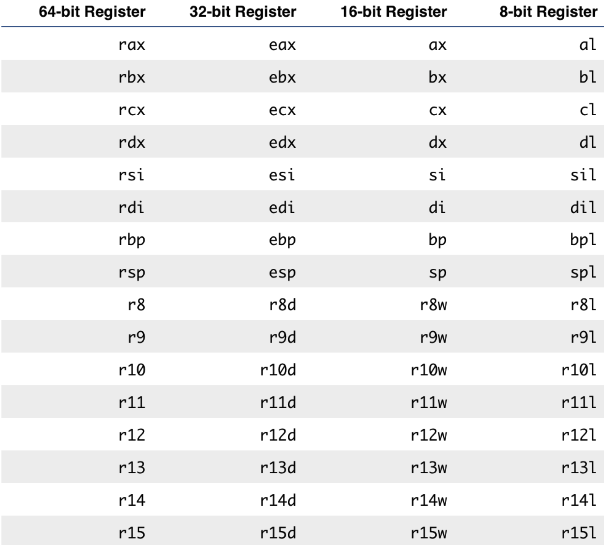
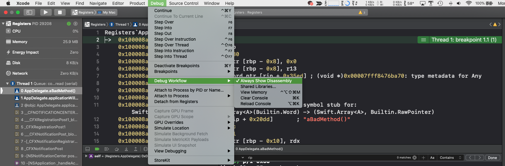

# Chapter 12

assembly를 표시하는 flavor는 **Intel**과 **AT&T**이 있으며, lldb는 AT&T가 기본이다. AT&T는 `opcode`, `source`, `destination`들로 구성되어 있는데, 이 예시로는 `movq`, `$0x78`, `%rax` 이런 식이다. 이는 `%rax`에서 `$0x78` 만큼 이동(move)한다.

syntax는 아래와 같이 변경이 가능하며, `~/.lldbinit`에 넣으면 편하다.

```
settings set target.x86-disassembly-flavor intel
settings set target.skip-prologue false
```

첫번째 명령어는 x86 (32비트, 64비트 둘 다)에 Intel flavor로 표시해주며, 두번째는 function prologue를 skip하지 않도록 한다. function prologue는 Chapter 11에서 했던 내용들이다.

Intel flavor로 설정할 경우 AT&T에서 보았던 `%`과 `$` 기호들이 사라진다. 따라서 `movq`, `$0x78`, `%rax` 대신에 `movq`, `0x78`, `rax` 이렇게 보인다. 

## 연습

### cpx 명령어

`~/.lldbinit`에서 `cpx` 명령어를 만들어준다.

````
command alias -H "Print value in ObjC context in hexadecimal" -h "Print in hex" -- cpx expression -f x -l objc --
````

이는 Objective-C context를 hex 형식으로 register contents를 출력해준다. **Swift context**는 지원하지 않는다.

### Bits, bytes

메모리를 탐험하기 전에, 어떻게 메모리가 뭉쳐 있는지 (how memory is grouped) 부터 알아야 한다. 1 또는 0인 값을 bit라고 하고, 64개의 비트가 있는 것을 64-bit라고 한다.

8 bits가 뭉쳐 있으면, byte라고 한다. 그러면 1 byte는 0부터 255까지, 총 2^8 = 256가지의 경우의 수를 가질 수 있다. C의 `sizeof()` 함수는 이런 byte의 크기를 구한다. (참고로 ASCII 문자 인코딩은 1 byte를 가진다.)

```
# 1 byte
(lldb) p sizeof('A')
(unsigned long) $0 = 1

# 'A'를 binary representation
(lldb) p/t 'A'
(char) $1 = 0b01000001

# 'A'를 hexadecimal representation
(lldb) p/x 'A'
(char) $2 = 0x41
```

### The RIP register

AppDelegate를 아래와 같이 수정하고 `func aBadMethod()`에서 breakpoint를 설장하자.

```swift
@NSApplicationMain
class AppDelegate: NSObject, NSApplicationDelegate {
  func applicationWillBecomeActive(_ notification: Notification) {
    print(#function)
    self.aBadMethod()
  }
  
  func aBadMethod() {
    print(#function)
  }
  
  func aGoodMethod() {
    print(#function)
  }
}
```

그러면 에 $rip는 `aBadMethod`가 되는데, 해당 register를 `aGoodMethod`로 바꿔보자.

```
(lldb) cpx $rip
(unsigned long) $0 = 0x0000000100008a30

(lldb) image lookup -vrn ^Registers.*aGoodMethod
1 match found in /Users/pook/Library/Developer/Xcode/DerivedData/Registers-arwmylizsicndahjivtirjxkqojt/Build/Products/Debug/Registers.app/Contents/MacOS/Registers:
        # 생략...
        
         Symbol: id = {0x00000358}, range = [0x0000000100008af0-0x0000000100008bb0), name="Registers.AppDelegate.aGoodMethod() -> ()", mangled="$s9Registers11AppDelegateC11aGoodMethodyyF"
       Variable: id = {0x4000000e8}, name = "self", type = "Registers.AppDelegate", location = DW_OP_fbreg -8, decl = AppDelegate.swift:42

```

`aGoodMethod`의 주소는 `0x0000000100008af0`이므로

```
(lldb) register write rip 0x0000000100008af0
(lldb) c
aGoodMethod()
applicationWillBecomeActive(_:)
```

이렇게 `aBadMethod` 대신에 `aGoodMethod`가 실행된걸 볼 수 있는데... 이런 작업은 위험하다고 한다.

### Registers 표



위 표를 통해 아래와 같은 장난을 칠 수 있다.

```
(lldb) register write rdx 0x0123456789ABCDEF
(lldb) p/x $rdx
(unsigned long) $0 = 0x0123456789abcdef
(lldb) p/x $edx
(unsigned int) $1 = 0x89abcdef
(lldb) p/x $dx
(unsigned short) $2 = 0xcdef
(lldb) p/x $dl
(unsigned char) $3 = 0xef
(lldb) p/x $dh
(unsigned char) $4 = 0xcd
```

`dh`는 `dx`에서 `dl`로 내려갈 때 반으로 갈라진 높은(high) 부분을 표시한다.

```
(lldb) register write $r9 0x0123456789abcdef
(lldb) p/x $r9
(unsigned long) $5 = 0x0123456789abcdef
(lldb) p/x $r9d
(unsigned int) $6 = 0x89abcdef
(lldb) p/x $r9w
(unsigned short) $7 = 0xcdef
(lldb) p/x $r9l
(unsigned char) $8 = 0xef
```

## 메모리 분석

위에서 추가한 `aBadMethod`에 breakpoint를 걸어주고, `Debug -> Debug Workflow -> Always Show Disassembly`를 켜주자.



그리고 아래 명령어를 실행하면 현재 breakpoint의 주소가 나오는데

```
(lldb) cpx $rip
(unsigned long) $5 = 0x0000000100008a30
```

이 메모리를 읽는 명령어를 실행하면 Xcode에서 보는 화면과 같게 나온다. `-c`는 보여줄 개수이다. `-fi`는 formatting 형식이고, 여기서는 instruction.

```
(lldb) memory read -fi -c1 0x0000000100008a30
->  0x100008a30: 55  push   rbp

(lldb) memory read -fi -c4 0x0000000100008a30
->  0x100008a30: 55                       push   rbp
    0x100008a31: 48 89 e5                 mov    rbp, rsp
    0x100008a34: 48 83 ec 30              sub    rsp, 0x30
    0x100008a38: 48 c7 45 f8 00 00 00 00  mov    qword ptr [rbp - 0x8], 0x0
    
# rbp에서 0x55 만큼 이동(move)
(lldb) expression -f i -l objc -- 0x55
(int) $6 = 55  push   rbp
```

`memory read -fi -c'n'`는 `x/'n'i` 명령어로도 볼 수 있다.

```
(lldb) memory read -fi -c4 0100007c20
    0x100007c20: 55           push   rbp
    0x100007c21: 48 89 e5     mov    rbp, rsp
    0x100007c24: 49 8b 7d 10  mov    rdi, qword ptr [r13 + 0x10]
    0x100007c28: 49 8b 75 18  mov    rsi, qword ptr [r13 + 0x18]
(lldb) x/4i 0x100007c20
    0x100007c20: 55           push   rbp
    0x100007c21: 48 89 e5     mov    rbp, rsp
    0x100007c24: 49 8b 7d 10  mov    rdi, qword ptr [r13 + 0x10]
    0x100007c28: 49 8b 75 18  mov    rsi, qword ptr [r13 + 0x18]
```

여기서... 위에서 `0x55` 만큼 이동(move)했으니까, 똑같이 `0x100007c21: 48 89 e5     mov    rbp, rsp`도 `0x4889e5` 만큼 이동(move)시키면 뜨겠지? 생각하지만 아니다.

```
(lldb) p/i 0x4889e5
(Int) $R8 = e5 89  in     eax, 0x89
```

이렇게 엉뚱한 값이 나온다. 이는 x64와 ARM의 `endianness` 때문이다. 예를 들어 `0xabcd`의 경우, `0xcd`가 먼저 쌓이고, `0xab`가 뒤에 쌓이는 방식이다.

즉, `48 89 e5`의 경우 48 -> 89 -> e5 이므로, `0xe58948`이 된다.

```
(lldb) p/i 0xe58948
(Int) $R12 = 48 89 e5  mov    rbp, rsp
```

## endianness

```
(lldb) memory read -s1 -c20 -fx 0x100003840
0x100003840: 0x88 0x00 0x00 0x48 0x8b 0x7d 0xe0 0x4c
0x100003848: 0x8b 0x6d 0xf0 0x48 0x89 0x45 0xd0 0xe8
0x100003850: 0x1c 0x00 0x00 0x00
(lldb) memory read -s2 -c10 -fx 0x100003840
0x100003840: 0x0088 0x4800 0x7d8b 0x4ce0 0x6d8b 0x48f0 0x4589 0xe8d0
0x100003850: 0x001c 0x0000
(lldb) memory read -s4 -c5 -fx 0x100003840
0x100003840: 0x48000088 0x4ce07d8b 0x48f06d8b 0xe8d04589
0x100003850: 0x0000001c
```

endianess가 적용된 걸 볼 수 있다.

