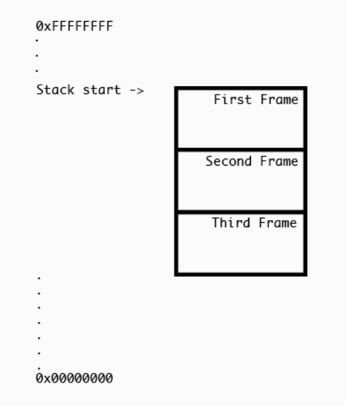

# Chapter 13

Chapter 11에서 x86_64의 하나의 stack에는 최대 6개 까지의 parameters만 들어올 수 있다고 했는데, 이게 정확히 뭔지 알아보기 위해 stack에 대해 자세히 공부해보자.

## Stack



프로그램이 실행되면, stack은 사진처럼 높은 값에서 낮은 값으로 내려간다. 이를 heap에 향해간다고 한다. (towards the heap) stack의 크기는 OS의 커널이 각 쓰레드에 결정한다. stack은 유한한 공간이기에, 커널이 정해준 크기를 초과하거나 heap을 넘어설 경우 overflow가 발생하며, stack overflow라고도 한다.

### Stack pointer && base pointer registers

`RSP`와 `RBP`에 대해 알아보자. RSP는 stack pointer resgister의 약자로, 특정 thread의 stack의 위치를 나타낸다.


stack은 아래로 증가하는데, `RSP`는 마지막 stack의 pointer이다.

`RBP`는 base pointer register의 약자로, 현재 함수의 베이스 포인터를 나타낸다. OS에 따라 없을수도 있다는듯?


NOTE : Xcode나 lldb에서 stack frame을 변경할 때마다 `RBP`와 `RSP`는 새로운 frame에 맞게 변경된다. 이는 해당 frame의 local variables offset을 얻기 위함이다. 만약 `RBP`가 변하지 않는다면 그 function의 local variables을 얻을 수 없게 되고 그러면 crash가 난다.

프로그램을 debug 모드가 아닌 release로 컴파일하면, variables과 parameters의 references는 삭제되지만, 이런 `RSP` 와 `RBP`는 남아 있다.

## opcodes

### push

`int`나 Objective-C instance, Swift class를 stack에 저장해야 할 때, `push` opcode가 시용된다. 이러면 새로운 `RSP` 값이 지정된다.

예를 들어 아래와 같이 `push`에 5를 넣어준다면, 보통 64비트 아키텍쳐에서는 8 bytes가 추가된다.

```
push 0x5
```

그러면 C pseudocode는 아래와 같다.

```
RSP = RSP - 0x8
*RSP = 0x5
```

### pop

`pop`은 `push`와 반대다.

```
pop rdx
```

이걸 실행하면 아래와 같은 pseudocode가 실행된다.

```
RDX = *RSP
RSP = RSP + 0x8
```

### call

call은 function을 실행하는 역할을 한다. 0x7fffb34df410가 아래와 같이 있다고 가정하면

```
0x7fffb34de913 <+227>: call   0x7fffb34df410            
0x7fffb34de918 <+232>: mov    edx, eax
```

instruction이 실행될 때, 아래처럼 `RIP` register가 바뀌고 실행된다.

```
RIP = 0x7fffb34de918
RSP = RSP - 0x8
*RSP = RIP
RIP = 0x7fffb34df410
```

### ret

`call`의 반대

## 연습

아래와 같이 짜여진 assembly 함수가 있다.

```assembly
.globl _StackWalkthrough

_StackWalkthrough:
      push  %rbp
      movq  %rsp, %rbp
      movq  $0x0, %rdx
      movq  %rdi, %rdx
      push  %rdx
      movq  $0x0, %rdx
      pop   %rdx
      pop   %rbp
      ret
```

이를 Bridging Header에 넣고

```objective-c
#import "StackWalkthrough.h"
```

ViewController에서 실행하고, StackWalkthrough로 Symbolic Breakpoint를 걸어주면

```swift
override func awakeFromNib() {
  super.awakeFromNib()
  StackWalkthrough(5)
}
```

Xcode Debug 화면에서 아래와 같은 화면이 뜬다.


이는 위에서 정의한 함수와 일치하며, 이 내용들을 톺아보면

```assembly
Registers`StackWalkthrough:
->  0x103980210 <+0>:  pushq  %rbp # RBP를 stack에 push 한다. (RSP = RBP, RSP는 감소)
    0x103980211 <+1>:  movq   %rsp, %rbp
    0x103980214 <+4>:  movq   $0x0, %rdx
    0x10398021b <+11>: movq   %rdi, %rdx
    0x10398021e <+14>: pushq  %rdx # RDX를 stack에 push 한다. (RSP = RDX, RSP는 감소)
    0x10398021f <+15>: movq   $0x0, %rdx
    0x103980226 <+22>: popq   %rdx # RDX를 날린다 (RDX = *RSP, RSP 증가)
    0x103980227 <+23>: popq   %rbp # RBP를 날린다 (RBP = *RSP, RSP 증가)
    0x103980228 <+24>: retq   # 함수 return (RIP = *RSP, RSP 증가)
```

Symbolic Breakpoint 대신, `awakeFromNib()`에서 `StackWalkthrough(5)`에 breakpoint를 걸어주면


아까와는 다른 모습이 보이며, `callq`가 불린걸 볼 수 있다. 그 다음에 `dumpreg` 명령어를 만들어줘서 `RBP`, `RSP`, `RDI`, `RDX`를 출력해보자

```
(lldb) command alias dumpreg register read rsp rbp rdi rdx
(lldb) dumpreg
     rsp = 0x00007ffeed2cb4c0
     rbp = 0x00007ffeed2cb4f0
     rdi = 0x0000000000000005
     rdx = 0x0000000000000023
```

`si`를 입력하면 다음 instruction으로 넘어갈 수 있는데, 위에서 작성한 pseudocode대로 값이 바뀌는걸 볼 수 있다.

## 7개가 넘는 parameters 처리

`RDI`, `RSI`, `RDX`, `RCX`, `R8`, `R9 ` 이렇게 parameters가 들어 오는데, 7개가 넘으면 stack에 저장한다.

`viewDidLoad()`에 `executeLotsOfArguments`를 추가해주고, breakpoint를 걸어주자.

```swift
override func viewDidLoad() {
  super.viewDidLoad()
  _ = self.executeLotsOfArguments(one: 1, two: 2, three: 3, four: 4, five: 5, six: 6, seven: 7, eight: 8, nine: 9, ten: 10)
}
```

그러면 아래와 같이 뜨는데... `qword`라고 적힌 부분을 보면 해당 stack에 argument를 넣어주는걸 볼 수 있다.


```assembly
0x107b599ee <+126>: mov    qword ptr [rsi + 0x18], 0xa
0x107b599f6 <+134>: mov    qword ptr [rsi + 0x10], 0x9
0x107b599fe <+142>: mov    qword ptr [rsi + 0x8], 0x8
0x107b59a06 <+150>: mov    qword ptr [rsi], 0x7
```

이들은 local variables를 저장하는 scratch space에 저장된다. 이 공간은 아래와 같다.

```assembly
0x107b59976 <+6>:   sub    rsp, 0x68
```

`push` 를 하게 되면 `RSP`에 더 많은 쓰기가 작동하므로, 이는 비효율적이라 이런 방식으로 작동한다고 한다.

## Debugging Info

stack은 함수를 호출(call) 할 때도 쓰이지만, scratch space에 local variables를 저장할 때도 쓰인다.


`executeLotsOfArguments` Symbolic Breakpoint를 설정해주면 위와 같이 뜬다. 위 사진의 아래를 보면 argument에는 분명 1, 2, 3, ..., 9, 10 이렇게 했는데, 이상한 랜덤값들이 뜨는 것을 볼 수 있다.

이 이유는 값들이 **DWARF Debugging Infomation**에 저장되는데 아직 안 됐기 때문이다.

```
(lldb image dump symfile Registers

# 생략

0x7fcf0dde0ea8:     Variable{0x3000002ae}, name = "one", type = {00000003000010bc} 0x00007FCF4E2265A0 (Swift.Int), scope = parameter, decl = ViewController.swift:65, location = DW_OP_fbreg -48

# 생략
```

-48은 hexadecimal로 바꾸면 0xe8이다. `si`를 계속 입력해서

```assembly
0x10ffa2c33 <+195>:  mov    qword ptr [rbp - 0xe8], rdi
```

까지 계속 step을 밟고, `po one`을 입력하면

```
(lldb) po one
1
```

이렇게 정상적으로 나오는 걸 볼 수 있다. 실제 값에 -48을 해서 저장한다는 것 같다.