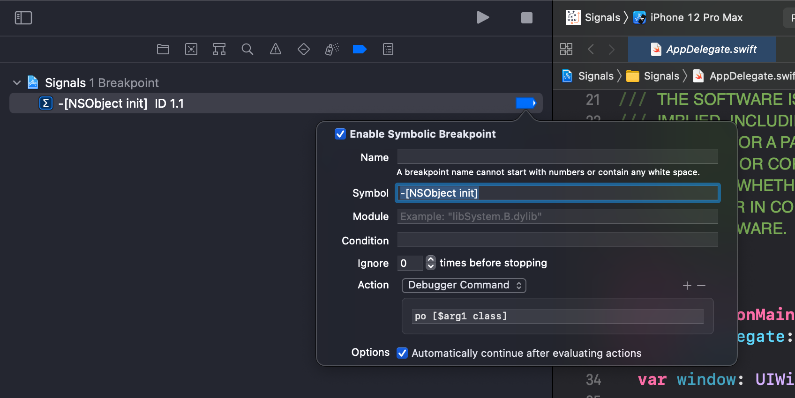
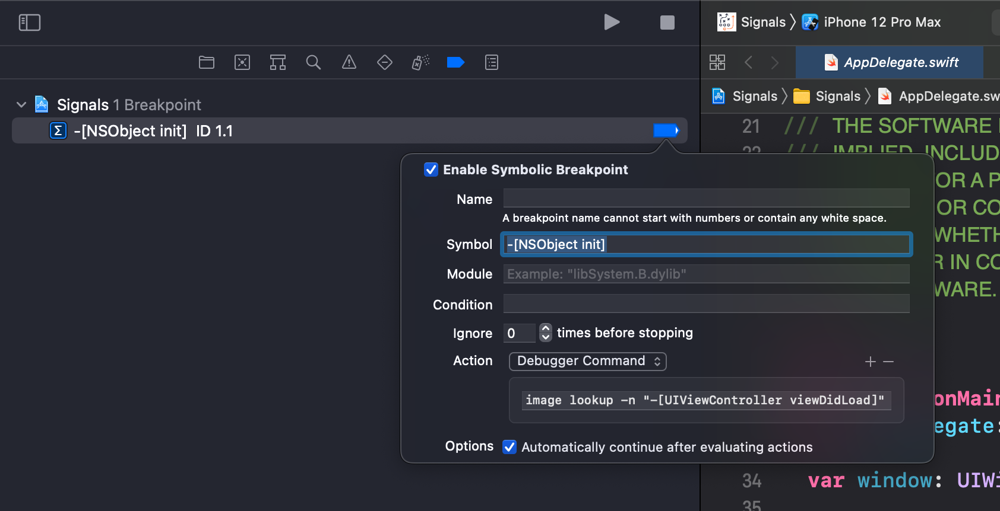
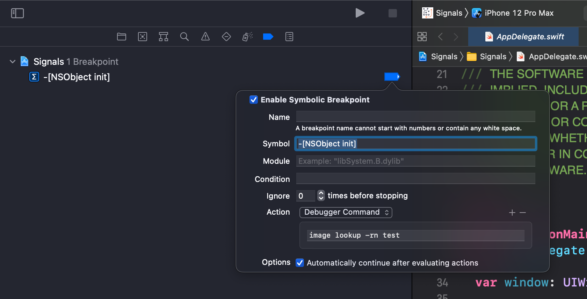
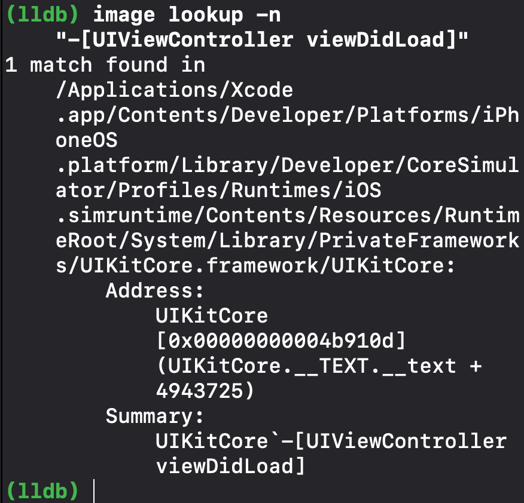

# Chapter 4

### Unix Signals

- SIGSTOP : 상태를 save하고 pause
- SIGCONT : resume

### Xcode breakpoints



`-[NSObject init]`이 될 때마다 Action 실행

```
_UIFontTextStyleCacheKey

_UIEventEnvironmentClearTouchesContext

_UIEventEnvironmentClearTouchesContext

NSISEngine
```



`(lldb) image lookup -n "-[UIViewController viewDidLoad]"`

This command dumps the implementation address (the offset address of where this method is located within the framework's binary) of the function for -[UIViewController viewDidLoad]

-n : name

```
1 match found in /Applications/Xcode.app/Contents/Developer/Platforms/iPhoneOS.platform/Library/Developer/CoreSimulator/Profiles/Runtimes/iOS.simruntime/Contents/Resources/RuntimeRoot/System/Library/PrivateFrameworks/UIKitCore.framework/UIKitCore:
        Address: UIKitCore[0x00000000004b910d] (UIKitCore.__TEXT.__text + 4943725)
        Summary: UIKitCore`-[UIViewController viewDidLoad]
1 match found in /Applications/Xcode.app/Contents/Developer/Platforms/iPhoneOS.platform/Library/Developer/CoreSimulator/Profiles/Runtimes/iOS.simruntime/Contents/Resources/RuntimeRoot/System/Library/PrivateFrameworks/UIKitCore.framework/UIKitCore:
        Address: UIKitCore[0x00000000004b910d] (UIKitCore.__TEXT.__text + 4943725)
        Summary: UIKitCore`-[UIViewController viewDidLoad]
```



`(lldb) image lookup -rn test`

test라는 image를 표시

```
1 match found in /Users/pook/Library/Developer/Xcode/DerivedData/Signals-dzbhfxeyedugsyehzsptxpcyrmsn/Build/Products/Debug-iphonesimulator/Signals.app/Signals:
        Address: Signals[0x0000000100007d20] (Signals.__TEXT.__text + 18032)
        Summary: Signals`Signals.DetailViewController.test() throws -> () at DetailViewController.swift:52
```

Action에 등록 안하고도, 콘솔창에서 직접 명령어 입력도 가능!



### Objective-C properties

```objective-c
@interface TestClass : NSObject
@property (nonatomic, strong) NSString *name;
@end
```

이렇게 정의된 object가 있으면, getter의 경우

`(lldb) image lookup -n "-[TestClass name]"`

```
1 match found in /Users/pook/Library/Developer/Xcode/DerivedData/Signals-dzbhfxeyedugsyehzsptxpcyrmsn/Build/Products/Debug-iphonesimulator/Signals.app/Signals:
        Address: Signals[0x00000001000036b0] (Signals.__TEXT.__text + 0)
        Summary: Signals`-[TestClass name] at TestClass.h:32
```

setter의 경우

`(lldb) image lookup -n "-[TestClass setName:]"`

```
1 match found in /Users/pook/Library/Developer/Xcode/DerivedData/Signals-dzbhfxeyedugsyehzsptxpcyrmsn/Build/Products/Debug-iphonesimulator/Signals.app/Signals:
        Address: Signals[0x00000001000036d0] (Signals.__TEXT.__text + 32)
        Summary: Signals`-[TestClass setName:] at TestClass.h:32
```

Dot notation을 써도, 위 getter/setter lookup은 작동함

```objective-c
TestClass *a = [[TestClass alloc] init];

// Both equivalent for setters
[a setName: @"hello, world"];
a.name = @"hello, world";

// Both equivalent for getters
NSString *b;
b = [a name]; // b = @"hello, world"
b = a.name; // b = @"hello, world"
```

### Swift properties

```swift
class SwiftTestClass: NSObject {
  var name: String!
}
```

이렇게 정의된 object가 있으면, setter의 경우

`(lldb) image lookup -rn Signals.SwiftTestClass.name.setter`

**-n이 아닌 -rn임을 유념**

```
1 match found in /Users/pook/Library/Developer/Xcode/DerivedData/Signals-dzbhfxeyedugsyehzsptxpcyrmsn/Build/Products/Debug-iphonesimulator/Signals.app/Signals:
        Address: Signals[0x000000010000e6c0] (Signals.__TEXT.__text + 45072)
        Summary: Signals`Signals.SwiftTestClass.name.setter : Swift.Optional<Swift.String> at SwiftTestClass.swift:32
```

비슷하게

`(lldb) b Signals.SwiftTestClass.name.setter : Swift.Optional<Swift.String>`

도 작동하는데, 띄어쓰기 조심해야함. 아래 명령어는 오류난다.

`(lldb) b Signals.SwiftTestClass.name.setter: Swift.Optional<Swift.String>`

마찬가지로 Objective-C로도 작동. ""은 있어도 되고 없어도 됨.

`(lldb) b "-[TestClass name]"`

getter와 setter를 동시에 하고 싶으면

`(lldb) image lookup -rn Signals.SwiftTestClass.name`

## Regex(정규 표현식) breakpoints and scope

`rbeak` (`breakpoint set -r %1`의 줄임), 쉽게 regex(정규 표현식)을 만들어줌. breakpoint를 하나만 걸어주는 b랑은 다르게, rb는 search하고 해당되는 모든 locations에 breakpoint를 걸어줌.

`(lldb) b Signals.SwiftTestClass.name.setter : Swift.Optional<Swift.String>`

대신

`(lldb) rb SwiftTestClass.name.setter`

`(lldb) rb name\.setter`

로 대체할 수 있음!

모든 UIViewController의 method가 호출될 때마다 breakpoint를 걸고 싶으면

```
(lldb) rb '\-\[UIViewController\ '
Breakpoint 2416: 761 locations.
```

이렇게 하면 되는데... regular expression search를 위해서는 back slash(\)를 적어줘야 한다고 함. 아무튼 b랑은 다르게 모든 locations에 breakpoint가 걸림.

### Objective-C category, 그리고 Optional 삽입

Objective-C category를 호출할 때

```objective-c
(-|+)[ClassName(categoryName)
```

이런 식으로 호출되는데... 그럼 `categoryName`은 어떻게 처리해야 하나?가 문제다. 이는 optional parenthesis를 쓰면 된다.

```
(lldb) rb '\-\[UIViewController(\(w+\))?\ '
Breakpoint 1: 761 locations.
```

### 특정 파일 및 라이브러리에만 breakpoint를 제한

````
(lldb) rb . -f DetailViewController.swift
Breakpoint 2: 65 locations.
````

이러면 `DetailViewController.swift` 안에 있는 모든 코드에 breakpoint가 걸린다! 모든 파일과 모든 코드 (UIKit, Foundation 모두 포함)에 breakpoint가 걸리길 원하면 (그럴 일 없겠지만)

```
(lldb) rb .
```

라이브러리에 제한을 걸고 싶다면 (UIKit, UIKitCore, Foundation...)

```
(lldb) rb . -s Commons
Breakpoint 1: 128 locations.
```

첫번째 breakpoint만 정지시키고, 첫번째꺼가 끝나면 나머지는 다 무시하고 삭제하고 첫번째꺼도 삭제 (one-shot)

```
(lldb) rb . -s UIKitCore -o 1
```

### 특정 언어에만 제한

-L 옵션

```
(lldb) breakpoint set -L swift -r . -s Commons
```

### 소스 코드 (평문)이 포함되어 있는 부분을 검색하고 breakpoint

-p옵션

```
(lldb) breakpoint set -A -p "if let"
```

-A 옵션은 프로젝트내 소스코드를 검색. 파일 검색을 원하면 -f

```
(lldb) breakpoint set -p "if let" -f MasterViewController.swift -f DetailViewController.swift
```

-s와 -A를 같이 쓸 수도 있음

```
(lldb) breakpoint set -p "if let" -s Signals -A
```

### 복잡하게

```
(lldb) breakpoint set -n "-[UIViewController viewDidLoad]" -C "po $arg1" -G1
Breakpoint 5: where = UIKitCore`-[UIViewController viewDidLoad], address = 0x00007fff23f3c10d
2020-10-27 01:51:49.581975+0900 Signals[2831:110500] Appending new signal: SIGSTOP
 po $arg1
<UIInputWindowController: 0x7fac36867800>


 po $arg1
<UIEditingOverlayViewController: 0x7fac3651f8d0>
```

## breakpoint 저장

```
(lldb) breakpoint write -f /tmp/br.json
```

cat

```
(lldb) platform shell cat /tmp/br.json
[{"Breakpoint":{"BKPTOptions":{"AutoContinue":true,"BKPTCMDData":{"ScriptSource":"None","StopOnError":true,"UserSource":["po $arg1"]},"ConditionText":"","EnabledState":true,"IgnoreCount":0,"OneShotState":false},"BKPTResolver":{"Options":{"NameMask":[4],"Offset":0,"SkipPrologue":false,"SymbolNames":["-[UIViewController viewDidLoad]"]},"Type":"SymbolName"},"Hardware":false,"SearchFilter":{"Options":{},"Type":"Unconstrained"}}}]
```

읽어오기

```
(lldb) breakpoint delete
About to delete all breakpoints, do you want to do that?: [Y/n] y
All breakpoints removed. (1 breakpoint)
(lldb) breakpoint read -f /tmp/br.json
New breakpoints:
Breakpoint 6: where = UIKitCore`-[UIViewController viewDidLoad], address = 0x00007fff23f3c10d
```

## breakpoint를 수정하거나 삭제하거나 비활성화하거나 활성화

### breakpoint 보기

```
(lldb) b main
Breakpoint 1: 95 locations.
```

이렇게 하면 `main`을 포함하는 95곳에 breakpoint가 걸리고, 1번인 것을 확인할 수 있음. 1번 breakpoint 목록을 보려면

```
(lldb) breakpoint list 1
1: name = 'main', locations = 95, resolved = 95, hit count = 0
  1.1: where = Signals`main at AppDelegate.swift, address = 0x000000010054c110, resolved, hit count = 0 
  1.2: where = Foundation`-[NSDirectoryTraversalOperation main], address = 0x00007fff2079a728, resolved, hit count = 0 
 # 생략
  1.94: where = MediaServices`-[MSVArtworkServiceResizeOperation main], address = 0x00007fff345c5e5d, resolved, hit count = 0 
  1.95: where = MediaServices`-[MSVArtworkServiceConversionOperation main], address = 0x00007fff345c6bbd, resolved, hit count = 0 
```

대충 이렇게 95개가 나오는걸 확인할 수 있음. 간단하게 보려면

```
(lldb) breakpoint list 1 -b
1: name = 'main', locations = 95, resolved = 95, hit count = 0
```

`breakpoint list 1`은 1번 breakpoint만 보여주는데, 만약 1~3번의 breakpoint를 보고 싶을 경우

```
(lldb) breakpoint list 1 3
(lldb) breakpoint list 1-3
```

**breakpoint 1번의 세번째를 보여주라는 뜻이 아님. 범위임.**

### breakpoint 삭제

breakpoint 1번을 모두 삭제

```
(lldb) breakpoint delete 1
```

breakpoint 1번의 첫번째만 삭제

```
(lldb) breakpoint delete 1.1
```

