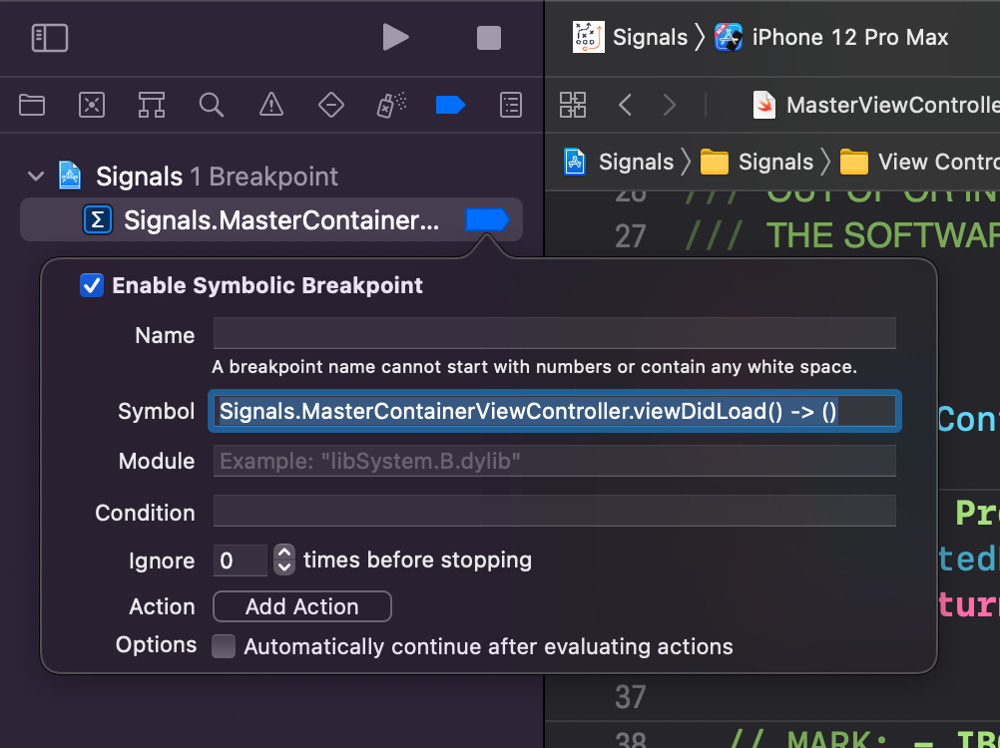

# Chapter 5

### NSObject: description & po

```swift
override func viewDidLoad() {
  super.viewDidLoad()
  print("\(self)")
}

override var description: String {
  return "Yay! debugging " + super.description
}
```

이 View Controller를 실행하면 아래와 같이 뜨고, stop를 걸고 `po self`를 입력하면 똑같이 나온다.

```
Yay! debugging <Signals.MasterViewController: 0x7fc1e7618060>
# stop
(lldb) po self
Yay! debugging <Signals.MasterViewController: 0x7fc1e7618060>
```

NSObject에는 `debugDescription`도 존재한다.

```swift
override func viewDidLoad() {
  super.viewDidLoad()
  print("\(self)")
}

override var description: String {
  return "Yay! debugging " + super.description
}

override var debugDescription: String {
  return "debugDescription: " + super.debugDescription
}
```

그러면 아래와 같이 나온다.

```
Yay! debugging <Signals.MasterViewController: 0x7fc1e7618060>
# stop
(lldb) po self
debugDescription: Yay! debugging <Signals.MasterViewController: 0x7fc1e7618060>
```

debugDescription을 쓰는 image들을 검색할 수도 있다.

```
(lldb) image lookup -rn '\ debugDescription\]'
2 matches found in /Applications/Xcode-beta.app/Contents/Developer/Platforms/iPhoneOS.platform/Library/Developer/CoreSimulator/Profiles/Runtimes/iOS.simruntime/Contents/Resources/RuntimeRoot/System/Library/Frameworks/Intents.framework/Intents:
        Address: Intents[0x00000000002c0e1c] (Intents.__TEXT.__text + 2879712)
        Summary: Intents`-[INIntent debugDescription]        Address: Intents[0x0000000000380c53] (Intents.__TEXT.__text + 3665687)
        Summary: Intents`-[INHelperServiceAccessSpecifier debugDescription]
```

po 명령어로 CALayer의 정보를 얻어올 수도 있다.

```
(lldb) po self.view!.layer.description
"<CALayer: 0x6000009e9440>"

(lldb) po self.view!.layer
<CALayer:0x6000009e9440; name = "VC:Signals.MasterViewController"; position = CGPoint (214 463); bounds = CGRect (0 0; 428 926); delegate = <UITableView: 0x7fc1e782dc00; frame = (0 0; 428 926); clipsToBounds = YES; autoresize = W+H; gestureRecognizers = <NSArray: 0x6000007cc150>; layer = <CALayer: 0x6000009e9440>; contentOffset: {0, 0}; contentSize: {0, 0}; adjustedContentInset: {0, 0, 0, 0}; dataSource: Yay! debugging <Signals.MasterViewController: 0x7fc1e7618060>>; sublayers = (<CALayer: 0x60000099a320>, <CALayer: 0x6000009ec360>); masksToBounds = YES; allowsGroupOpacity = YES; name = VC:Signals.MasterViewController; backgroundColor = <CGColor 0x600002db1c20> [<CGColorSpace 0x600002d84060> (kCGColorSpaceICCBased; kCGColorSpaceModelRGB; sRGB IEC61966-2.1; extended range)] ( 0.980392 0.980392 0.980392 1 )>
```

### p

```
(lldb) p self
(Signals.MasterViewController) $R16 = 0x00007fc1e7618060 {
  UIKit.UITableViewController = {
    baseUIViewController@0 = {
      baseUIResponder@0 = {
        baseNSObject@0 = {
          isa = Signals.MasterViewController
        }
      }
      _overrideTransitioningDelegate = nil
      _view = some {
        some = 0x00007fc1e782dc00 {
          baseUIScrollView@0 = {
            baseUIView@0 = {
              baseUIResponder@0 = {
                baseNSObject@0 = {
                  isa = UITableView
                }
              }
              _constraintsExceptingSubviewAutoresizingConstraints = nil
              _cachedTraitCollection = some {
                some = 0x00006000032a5450 {
                  baseNSObject@0 = {
                    isa = UITraitCollection
                  }
                  _clientDefinedTraits = nil
                  _environmentWrapper = nil
                }
              }
              _animationInfo = nil
              _layer = some {
                some = 0x00006000009e9440 {
                  baseNSObject@0 = {
                    isa = CALayer
                  }
                }
              }
              _layerRetained = some {
                some = 0x00006000009e9440 {...}
              }
              _gestureRecognizers = 0x00006000007cc150 8 elements
              _window = nil
              _subviewCache = 0x00006000007c5080 2 elements
              _viewDelegate = 0x00007fc1e7618060
              _cachedScreenScale = 3
              _layoutEngineWidth = 0
              _unsatisfiableConstraintsLoggingSuspensionCount = 0
              _pseudo_id = 41
              _retainCount = 8
```

객체에 대한 정보를 볼 수 있다. 맨 위에 `(Signals.MasterViewController) $R16 = 0x00007fc1e7618060`라고 적혀 있는데, 이 객체를 표현하는 변수이다. 따라서 아래오 같이 입력해도 똑같은 출력값을 얻는다.

```
(lldb) p $R16
```

### p의 출력값을 변경

```
(lldb) type summary add Signals.MasterViewController --summary-string "Wahoo!"
(lldb) p self
(Signals.MasterViewController) $R4 = 0x00007ffb28806380 Wahoo!

# 초기화
(lldb) type summary clear
(lldb) p self
# 원래 출력값이 나온다!
```

## Swift vs Objective-C

lldb에서는 Swift와 Objective-C 문법을 둘 다 지원하는데, 기본적으로 Swift 코드에서 stop을 할 경우 Swift 문법으로 선택되고, Objective-C 코드에서 stop을 할 경우 Objective-C로 선택된다. 아래 상태는 Swift 코드에서 stop이 된 상태이다.

```
(lldb) po [UIApplication sharedApplication]
error: <EXPR>:3:16: error: expected ',' separator
[UIApplication shardApplication]
               ^
              ,

(lldb) po UIApplication.shared
<UIApplication: 0x7ffb26f056c0>
```

Swift 코드에서 stop이 되었으므로, Objective-C 문법을 쓰면 오류가 난다. 이럴 경우 아래와 같이 언어 지정이 가능한데... 버그 때문인지 에러남. Objective-C++를 원하면 `objc++`라고 쓰면 된다고 한다.

```
(lldb) expression -l objc -O -- [UIApplication sharedApplication]
expression produced error: error: /var/folders/5_/xj61dv1x7pxgsvy1_vh2kxjw0000gn/T/expr48-4e8979..swift:1:79: error: expected ',' separator
Swift._DebuggerSupport.stringForPrintObject(Swift.UnsafePointer<UIApplication *>(bitPattern: 0x133910070)!.pointee)
```

반대로 Objective-C 코드에서 stop을 할 경우 Swift 문법을 인식하지 못한다.

```
(lldb) po UIApplication.shared
error: <user expression 2>:1:15: property 'shared' not found on object of type 'UIApplication'
UIApplication.shared
              ^
(lldb) po [UIApplication sharedApplication]
<UIApplication: 0x7ffb26f056c0>
```

### lldb에서 변수 정의

Objective-C 코드에서 stop을 하고

```
(lldb) po id test = [NSObject new]
(lldb) po test
error: <user expression 1>:1:1: use of undeclared identifier 'test'
test
^
```

이렇게 하면 에러가 난다. 변수를 정의할 때는 $를 붙이라고 한다.

```
(lldb) po id $test = [NSObject new]
(lldb) po $test
<NSObject: 0x6000006f0c30>
```

expression을 swift로 바꿔보자

```
(lldb) expression -l swift -O -- $test
<NSObject: 0x6000006f0c30>

(lldb) expression -l swift -O -- $test.description
error: <EXPR>:3:1: error: cannot find '$test' in scope
$test.description
^~~~~

(lldb) expression -l swift -O -- $test as NSObject
error: <EXPR>:3:1: error: cannot find '$test' in scope
$test as NSObject
^~~~~

(lldb) expression -l swift -O -- $test as! NSObject
error: <EXPR>:3:1: error: cannot find '$test' in scope
$test as! NSObject
^~~~~
```

되긴 되는데 한계는 있다. "just work."라고 기대하지 말라고 한다..

### Symbolic Breakpoint



```
Signals.MasterContainerViewController.viewDidLoad() -> ()
```

참고로 `viewDidLoad()`는 아래와 같이 생겼다.

```swif
override func viewDidLoad() {
	super.viewDidLoad()
	title = "Quarterback"
}
```

여기에 breakpoint를 걸어주면 아래와 같은 장난을 칠 수가 있다. $R0는 self랑 같은 reference다.

```
(lldb) po $R0.title
nil

(lldb) po $0.viewDidLoad()
error: <EXPR>:3:1: error: cannot find '$0' in scope
$0.viewDidLoad()
^~

(lldb) po $R0.viewDidLoad()
0 elements

(lldb) po $R0.title
▿ Optional<String>
  - some : "Quarterback"
  
(lldb) po $R0.title = "dd"
0 elements

(lldb) po $R0.title
▿ Optional<String>
  - some : "dd"
  
# expression

(lldb) expression -l swift -- $R0.title
(String?) $R26 = "dd"
(lldb) expression -l swift -O -- $R0.viewDidLoad()
0 elements
```

### GDB format

```
(lldb) expression -G x -- 10
(int) $0 = 0x0000000a
(lldb) p/x 10
(int) $1 = 0x0000000a
(lldb) p/x 10
(int) $2 = 0x0000000a
(lldb) p/t 10
(int) $3 = 0b00000000000000000000000000001010
(lldb) p/t -10
(int) $4 = 0b11111111111111111111111111110110
(lldb) p/t 10.0
(double) $5 = 0b0100000000100100000000000000000000000000000000000000000000000000
(lldb) p/d 'D'
(char) $6 = 68
(lldb) p/c 1430672467
(int) $7 = STFU
```

자세한건 https://sourceware.org/gdb/onlinedocs/gdb/Output-Formats.html