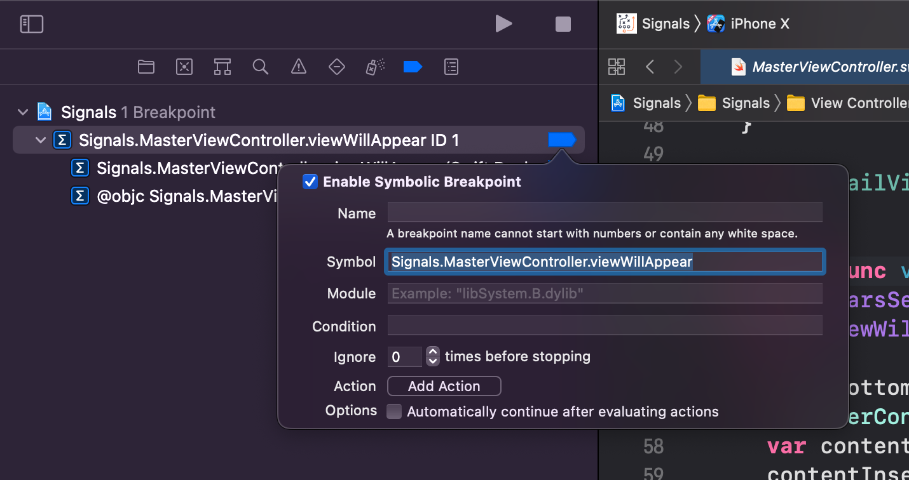
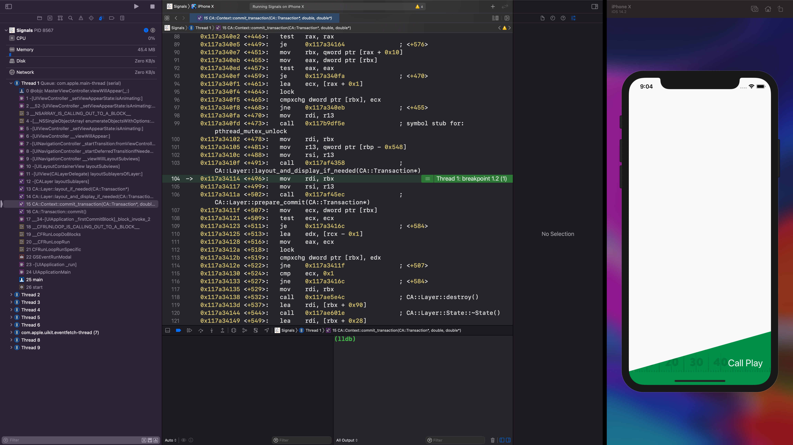
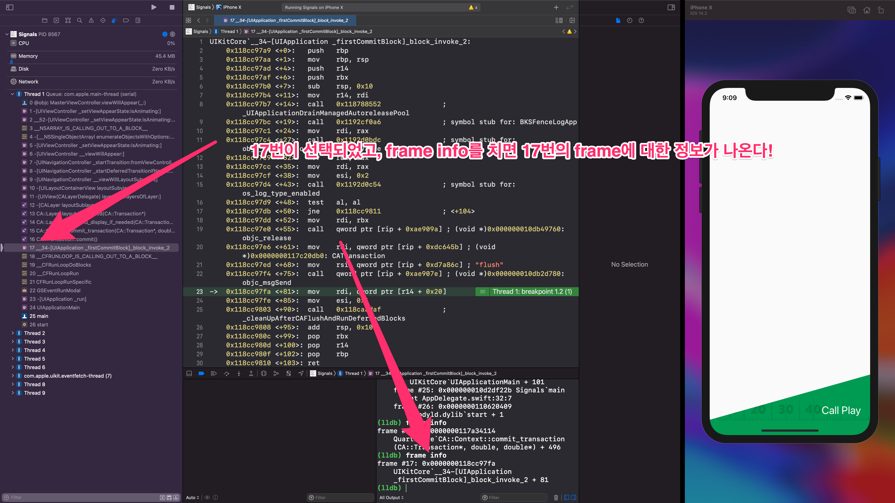
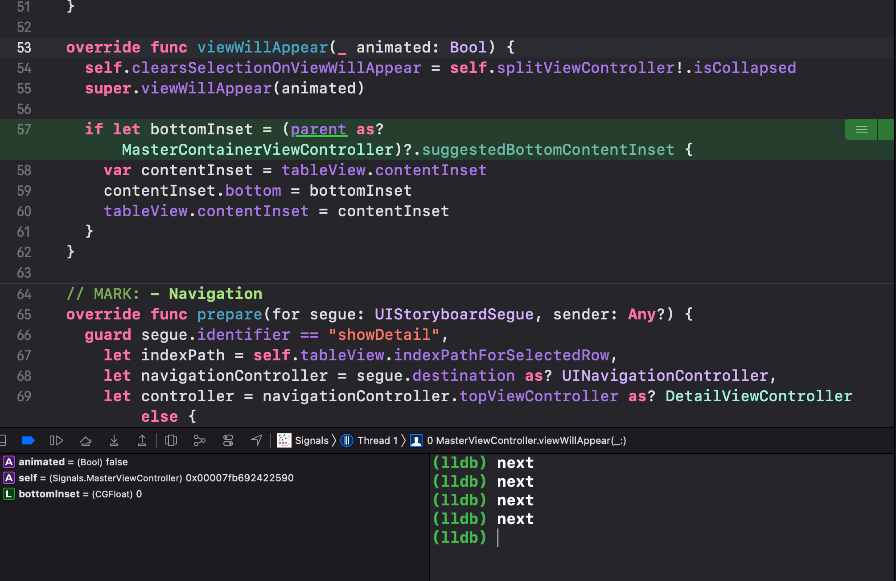
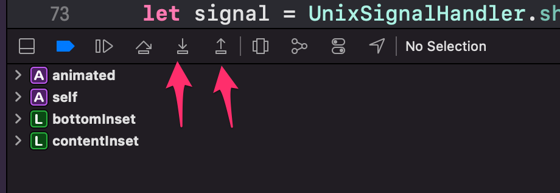

# Chapter 6

## 메모리의 구조

[메모리의 구조 (www.tcpschool.com)](http://www.tcpschool.com/c/c_memory_structure)

### stack frames



```
Signals.MasterViewController.viewWillAppear
```

로 breakpoint를 걸어주면 아래와 같이 stack을 track 할 수 있다. (책에서는 `Signals.MasterViewController.viewWillAppear(Swift.Bool) -> ()`로 하라고 하는데 작동하지 않음...)



main에서 Signals.MasterViewController.viewWillAppear로 오기 까지 stack의 frame들을 볼 수 있다.

이런 trace는 lldb로도 볼 수 있다.

```
(lldb) thread backtrace
* thread #1, queue = 'com.apple.main-thread', stop reason = breakpoint 1.2
    frame #0: 0x000000010d2d7ae0 Signals`@objc MasterViewController.viewWillAppear(_:) at <compiler-generated>:0
    
    # 생략...
    
    frame #23: 0x0000000118cac187 UIKitCore`-[UIApplication _run] + 912
    frame #24: 0x0000000118cb1038 UIKitCore`UIApplicationMain + 101
    frame #25: 0x000000010d2df22b Signals`main at AppDelegate.swift:32:7
    frame #26: 0x0000000110620409 libdyld.dylib`start + 1
```



위 사진처럼 Debug Navigator에서 17번 frame을 선택하고 lldb에 `frmae info`를 치면 해당 정보를 얻을 수 있다.

```
(lldb) frmae info
frame #17: 0x0000000118cc97fa UIKitCore`__34-[UIApplication _firstCommitBlock]_block_invoke_2 + 81
```

lldb에서 선택을 변경할 수도 있다. 아래 명령어를 치면 Xcode의 Debug Navigator도 바귄다.

```
(lldb) frame select 1 # 또는 f 1
frame #1: 0x000000011857e202 UIKitCore`-[UIViewController _setViewAppearState:isAnimating:] + 654
UIKitCore`-[UIViewController _setViewAppearState:isAnimating:]:
->  0x11857e202 <+654>: mov    rsi, qword ptr [rip + 0x14d347f] ; "_embeddedDelegate"
    0x11857e209 <+661>: mov    rdi, r13
    0x11857e20c <+664>: call   rbx
    0x11857e20e <+666>: mov    rdi, rax
    0x11857e211 <+669>: call   0x1192d0bdc               ; symbol stub for: objc_retainAutoreleasedReturnValue
    0x11857e216 <+674>: mov    rbx, rax
    0x11857e219 <+677>: mov    rdi, rax
    0x11857e21c <+680>: call   qword ptr [rip + 0x123465e] ; (void *)0x000000010db49760: objc_release
```

또한 모든 frame에서 초록색으로 breakpoint가 걸린걸 볼 수 있는데, assembly에서 해당 frame의 위치를 나타낸다.

## lldb에서 run과 next

```
(lldb) run
```

run을 실행하면 앱을 다시 빌드하지 않고도, 앱을 재실행 할 수 있다!

```
(lldb) next
```

breakpoint가 걸린 지점부터 코드를 하나하나 실행할 수 있다. 아래와 같이 코드 하나하나 실행될 때마다 breakpoint를 자동으로 걸어준다!



```
(lldb) step
```

step은 실제 코드가 아닌, assembly에서 주소를 하나하나 step을 밟는다. step을 그만두고 싶으면 `finish`를 입력하자.



Xcode에서도 step을 쓸 수 있다.

### target.process.thread.step-in-avoid-nodebug

debug symbol (debug information)이 존재하지 않는 것들은 step에서 무시하도록 설정할 수 있다.

```
(lldb) settings set target.process.thread.step-in-avoid-nodebug true
(lldb) settings show target.process.thread.step-in-avoid-nodebug
target.process.thread.step-in-avoid-nodebug (boolean) = true
```

위 설정은 `-a0` 옵션으로 무시할 수 있다.

```
(lldb) step -a0
```

https://stackoverflow.com/a/38209694

### frame variable

선택된 frame의 variable 들을 볼 수 있다.

```
(lldb) f 0
frame #0: 0x00000001080733b0 Signals`MasterViewController.viewWillAppear(animated=false, self=0x0000000000000000) at MasterViewController.swift:53
   50  	    self.detailViewController = detailViewController
   51  	  }
   52  	
-> 53  	  override func viewWillAppear(_ animated: Bool) {
   54  	    self.clearsSelectionOnViewWillAppear = self.splitViewController!.isCollapsed
   55  	    super.viewWillAppear(animated)
   56  	
(lldb) frame variable
(Bool) animated = false
(Signals.MasterViewController) self = <uninitialized>
```

-F으로 flat해서 볼 수도 있다.

```
(lldb) frame variable -F self
self = <uninitialized>
```

