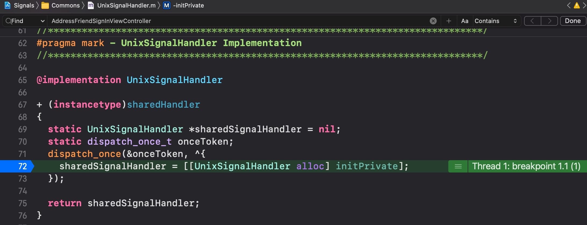
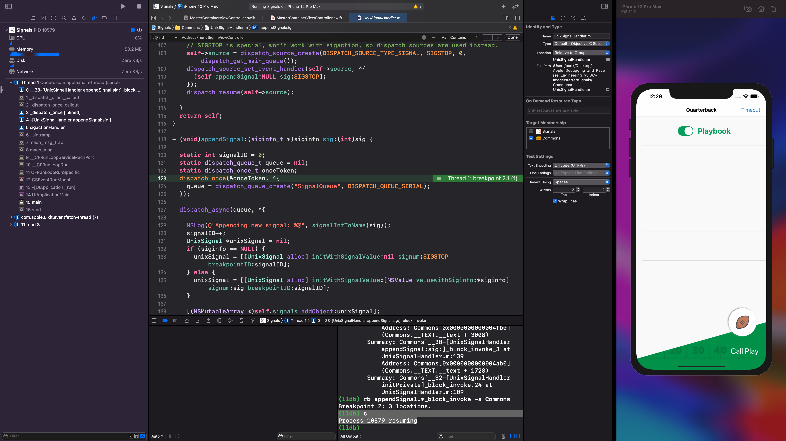

# Chapter 7

## modules

```
(lldb) image list
[  0] 4E6C2BB8-59AE-3AD9-9CC5-ED077E85881B 0x0000000103b3b000 /Users/pook/Library/Developer/Xcode/DerivedData/Signals-hcdxmfqgpfqkaqbxpizllfwcgebj/Build/Products/Debug-iphonesimulator/Signals.app/Signals 
[  1] A981F692-203E-3408-9F26-614E7F425B0E 0x0000000104145000 /usr/lib/dyld 
[  2] CD67BB61-ACDC-3CB4-A895-060302DDCF77 0x0000000103b79000 /Applications/Xcode-beta.app/Contents/Developer/Platforms/iPhoneOS.platform/Library/Developer/CoreSimulator/Profiles/Runtimes/iOS.simruntime/Contents/Resources/RuntimeRoot/usr/lib/dyld_sim 

# 생략...

(lldb) image list Foundation
[  0] 16ECBE10-D485-35C2-B9F2-DF9DC8B17D1E 0x000000010425d000 /Applications/Xcode-beta.app/Contents/Developer/Platforms/iPhoneOS.platform/Library/Developer/CoreSimulator/Profiles/Runtimes/iOS.simruntime/Contents/Resources/RuntimeRoot/System/Library/Frameworks/Foundation.framework/Foundation 
```

여기서 출력값을 분석해보면

1. module의 UUID 값이 나온다. 이 UUID 값은 symbolic information을 알아내거나 Foundation module의 버전을 특정한다.
2. UUID 뒤에는 load address가 있다. Signals 앱의 excutable의 process 공간에서 Foundation이 load된 위치를 나타낸다. (Following the UUID is the load address (0x000000010eb0c000). This identifies where the Foundation module is loaded into the Signals executable’s process space.)
3. module이 위치하고 있는 path

### module dump

아래 명령어로 UIKitCore를 dump 할 수 있다.

```
(lldb) image dump symtab UIKitCore -s address
Symtab, file = /Applications/Xcode-beta.app/Contents/Developer/Platforms/iPhoneOS.platform/Library/Developer/CoreSimulator/Profiles/Runtimes/iOS.simruntime/Contents/Resources/RuntimeRoot/System/Library/PrivateFrameworks/UIKitCore.framework/UIKitCore, num_symbols = 163840 (sorted by address):
               Debug symbol
               |Synthetic symbol
               ||Externally Visible
               |||
Index   UserID DSX Type            File Address/Value Load Address       Size               Flags      Name
------- ------ --- --------------- ------------------ ------------------ ------------------ ---------- ----------------------------------
[    0]      0     Code            0x0000000000002560 0x000000010e91a560 0x00000000000001fd 0x000e0000 -[UIColorWell _commonInit]
[    1]      1     Code            0x000000000000275d 0x000000010e91a75d 0x0000000000000064 0x000e0000 -[UIColorWell initWithFrame:]
[    2]      2     Code            0x00000000000027c1 0x000000010e91a7c1 0x000000000000011a 0x000e0000 -[UIColorWell initWithCoder:]

# 생략...
```

이 명령어로 UIKitCore의 모든 symbol table information을 dump 할 수 있다. -s는 sort이고 adress 순서대로 정렬한다.

아래 명령어로 `[UIViewController viewDidLoad]`의 정보를 얻어온다.

```
(lldb) image lookup -n "-[UIViewController viewDidLoad]"
1 match found in /Applications/Xcode-beta.app/Contents/Developer/Platforms/iPhoneOS.platform/Library/Developer/CoreSimulator/Profiles/Runtimes/iOS.simruntime/Contents/Resources/RuntimeRoot/System/Library/PrivateFrameworks/UIKitCore.framework/UIKitCore:
        Address: UIKitCore[0x00000000004c0cb6] (UIKitCore.__TEXT.__text + 4974422)
        Summary: UIKitCore`-[UIViewController viewDidLoad]
```

regular expression도 작동한다.

```
(lldb) image lookup -rn UIViewController
5 matches found in /Users/pook/Library/Developer/Xcode/DerivedData/Signals-hcdxmfqgpfqkaqbxpizllfwcgebj/Build/Products/Debug-iphonesimulator/Signals.app/Signals:
        Address: Signals[0x00000001000041d0] (Signals.__TEXT.__text + 2736)
        Summary: Signals`lazy protocol witness table accessor for type Swift.Array<__C.UIViewController> and conformance Swift.Array<A> : Swift.BidirectionalCollection in Swift at <compiler-generated>        Address: Signals[0x0000000100004110] (Signals.__TEXT.__text + 2544)
        Summary: Signals`type metadata accessor for __C.UIViewController at <compiler-generated>        Address: Signals[0x0000000100004220] (Signals.__TEXT.__text + 2816)
        
# 생략...
```

 여기서 결과를 잘 보면 UIViewController 뿐만 아니라 UIViewControllerBuiltinTransitionViewAnimator 같은 것도 나오는데, 이럴 경우는 아래처럼 regular expression을 잘 고치면 된다.

```
(lldb) image lookup -rn '\[UIViewController\ '
806 matches found in /Applications/Xcode-beta.app/Contents/Developer/Platforms/iPhoneOS.platform/Library/Developer/CoreSimulator/Profiles/Runtimes/iOS.simruntime/Contents/Resources/RuntimeRoot/System/Library/PrivateFrameworks/UIKitCore.framework/UIKitCore:
        Address: UIKitCore[0x00000000004b4c9f] (UIKitCore.__TEXT.__text + 4925247)
        Summary: UIKitCore`-[UIViewController _presentationControllerClassName]        Address: UIKitCore[0x00000000004b4cbc] (UIKitCore.__TEXT.__text + 4925276)
```

categories는 아래와 같이 하면 되는데 결과를 돌려보진 않겠음.

```
(lldb) image lookup -rn '\[UIViewController\(\w+\)\ '
```

### lookup + breakpoint + Objective-C block



`+[UnixSignalHandler sharedHandler]`에서 block 안에 있는 코드에 breakpoint를 걸고, info를 보면

```
(lldb) frame info
frame #0: 0x0000000105e3e480 Commons`__34+[UnixSignalHandler sharedHandler]_block_invoke(.block_descriptor=0x0000000105e46348) at UnixSignalHandler.m:72:28
```

`_block_invoke`라는 function 안에 block 안의 코드가 담겨 있는 것 같다. 한 번 `_block_invoke`를 lookup 해보자.

```
(lldb) image lookup -rn _block_invoke Commons
6 matches found in /Users/pook/Library/Developer/Xcode/DerivedData/Signals-chzvfusceqptbdbuuchzusqomxdt/Build/Products/Debug-iphonesimulator/Signals.app/Frameworks/Commons.framework/Commons:
        Address: Commons[0x0000000000004870] (Commons.__TEXT.__text + 1152)
        Summary: Commons`__32-[UnixSignalHandler initPrivate]_block_invoke at UnixSignalHandler.m:82        Address: Commons[0x0000000000004470] (Commons.__TEXT.__text + 128)
        Summary: Commons`__34+[UnixSignalHandler sharedHandler]_block_invoke at UnixSignalHandler.m:71        Address: Commons[0x0000000000004c00] (Commons.__TEXT.__text + 2064)
        Summary: Commons`__38-[UnixSignalHandler appendSignal:sig:]_block_invoke at UnixSignalHandler.m:123        Address: Commons[0x0000000000004c40] (Commons.__TEXT.__text + 2128)
        Summary: Commons`__38-[UnixSignalHandler appendSignal:sig:]_block_invoke_2 at UnixSignalHandler.m:127        Address: Commons[0x0000000000004fb0] (Commons.__TEXT.__text + 3008)
        Summary: Commons`__38-[UnixSignalHandler appendSignal:sig:]_block_invoke_3 at UnixSignalHandler.m:139        Address: Commons[0x0000000000004ab0] (Commons.__TEXT.__text + 1728)
        Summary: Commons`__32-[UnixSignalHandler initPrivate]_block_invoke.24 at UnixSignalHandler.m:109
```

마지막에 module 이름인 Commons를 안 쳐주면 UIKit, Foundation 등 모든 module들에서 검색해서 많은 결과가 나오므로 주의.

여기서 `appendSignal.*_block_invoke`에 breakpoint를 걸어주고 resume 하자.

```
(lldb) rb appendSignal.*_block_invoke -s Commons
Breakpoint 2: 3 locations.
(lldb) c
Process 10579 resuming
```

그리고 터미널에서 Signals에 SIGIO 신호를 보내주자.

```bash
$ pkill -SIGIO Signals
```

그러면 방금 설정한 breakpoint가 걸린다! 이로써 regular expression으로 설정한 breakpoint를 작동하는걸 확인할 수 있다.



pkill 명령어가 돌아가서 breakpoint가 찍힐 때마다 `frame info`를 돌려보면

```
(lldb) frame info
frame #0: 0x000000010fcf9c40 Commons`__38-[UnixSignalHandler appendSignal:sig:]_block_invoke_2(.block_descriptor=0x0000600002ef1840) at UnixSignalHandler.m:127
(lldb) c
Process 10741 resuming
2020-11-11 00:46:46.827620+0900 Signals[10741:844580] Appending new signal: SIGIO
(lldb) frame info
frame #0: 0x000000010fcf9fb0 Commons`__38-[UnixSignalHandler appendSignal:sig:]_block_invoke_3(.block_descriptor=0x000000010fd013b8) at UnixSignalHandler.m:139
```

`_block_invoke_2`, `_block_invoke_3` 이렇게 컴파일러가 숫자를 정해준걸 볼 수가 있다. 이걸 lookup 해보자.

```
(lldb) image lookup -t __block_literal_2
Best match found in /Users/pook/Library/Developer/Xcode/DerivedData/Signals-chzvfusceqptbdbuuchzusqomxdt/Build/Products/Debug-iphonesimulator/Signals.app/Frameworks/Commons.framework/Commons:
id = {0x200000a61}, name = "__block_literal_2", byte-size = 40, decl = UnixSignalHandler.m:82, compiler_type = "struct __block_literal_2 {
    void *__isa;
    int __flags;
    int __reserved;
    void (*__FuncPtr)();
    __block_descriptor_withcopydispose *__descriptor;
    UnixSignalHandler *self;
}"
```

`po $rdi`도 해보면

```
(lldb) po $rdi
<__NSMallocBlock__: 0x600002efee80>
```

function pointer도 얻어낼 수 있다.

```
(lldb) p/x ((__block_literal_2 *)0x600002efee80)->__FuncPtr
(void (*)()) $3 = 0x000000010fcf9c40 (Commons`__38-[UnixSignalHandler appendSignal:sig:]_block_invoke_2 at UnixSignalHandler.m:127)
```

### __NSMallocBlock__

아까 `po $rdi`를 했을 때 `__NSMallocBlock__`라는 class가 나왔는데

```
(lldb) po $rdi
<__NSMallocBlock__: 0x600002efee80>
```

이걸 lookup 해보면

```
(lldb) image lookup -rn __NSMallocBlock__
5 matches found in /Applications/Xcode-beta.app/Contents/Developer/Platforms/iPhoneOS.platform/Library/Developer/CoreSimulator/Profiles/Runtimes/iOS.simruntime/Contents/Resources/RuntimeRoot/usr/lib/system/libsystem_blocks.dylib:
        Address: libsystem_blocks.dylib[0x000000000000124d] (libsystem_blocks.dylib.__TEXT.__text + 15)
        Summary: libsystem_blocks.dylib`-[__NSMallocBlock__ retain]        Address: libsystem_blocks.dylib[0x0000000000001265] (libsystem_blocks.dylib.__TEXT.__text + 39)
        Summary: libsystem_blocks.dylib`-[__NSMallocBlock__ release]        Address: libsystem_blocks.dylib[0x000000000000126a] (libsystem_blocks.dylib.__TEXT.__text + 44)
        Summary: libsystem_blocks.dylib`-[__NSMallocBlock__ retainCount]        Address: libsystem_blocks.dylib[0x0000000000001270] (libsystem_blocks.dylib.__TEXT.__text + 50)
        Summary: libsystem_blocks.dylib`-[__NSMallocBlock__ _tryRetain]        Address: libsystem_blocks.dylib[0x0000000000001275] (libsystem_blocks.dylib.__TEXT.__text + 55)
        Summary: libsystem_blocks.dylib`-[__NSMallocBlock__ _isDeallocating]
```

별 다른 정보가 안 나온다. 이 뜻은 `__NSMallocBlock__`은 superclass에서 어떠한 method들도 override하지 않는다는 뜻이다. (또한 image lookup을 할 경우 superclass의 method들의 정보는 보여주지 않는다는걸 알 수 있다.)

그러면 `__NSMallocBlock__`의 superclass를 알아보자.

```
(lldb) po [__NSMallocBlock__ superclass]
NSBlock
```

`NSBlock`이라고 한다. 이걸 lookup 해보면

```
(lldb) image lookup -rn 'NSBlock\ '
7 matches found in /Applications/Xcode-beta.app/Contents/Developer/Platforms/iPhoneOS.platform/Library/Developer/CoreSimulator/Profiles/Runtimes/iOS.simruntime/Contents/Resources/RuntimeRoot/System/Library/Frameworks/CoreFoundation.framework/CoreFoundation:
        Address: CoreFoundation[0x000000000013c42d] (CoreFoundation.__TEXT.__text + 1286781)
        Summary: CoreFoundation`+[NSBlock allocWithZone:]        Address: CoreFoundation[0x000000000013c445] (CoreFoundation.__TEXT.__text + 1286805)
        Summary: CoreFoundation`+[NSBlock alloc]        Address: CoreFoundation[0x000000000013c45d] (CoreFoundation.__TEXT.__text + 1286829)
        Summary: CoreFoundation`-[NSBlock copy]        Address: CoreFoundation[0x000000000013c462] (CoreFoundation.__TEXT.__text + 1286834)
        Summary: CoreFoundation`-[NSBlock copyWithZone:]        Address: CoreFoundation[0x000000000013c467] (CoreFoundation.__TEXT.__text + 1286839)
        Summary: CoreFoundation`-[NSBlock invoke]        Address: CoreFoundation[0x000000000013c46a] (CoreFoundation.__TEXT.__text + 1286842)
        Summary: CoreFoundation`-[NSBlock performAfterDelay:]        Address: CoreFoundation[0x000000000013c4e3] (CoreFoundation.__TEXT.__text + 1286963)
        Summary: CoreFoundation`-[NSBlock debugDescription]
```

`invoke`라는 method가 있다. 이걸 쓰면 block을 실행할 수 있다.

```
(lldb) po id $block = (id)0x600002efee80 # po $rdi에서 나온 주소
(lldb) po [$block retain]
(lldb) po [$block invoke]
```

retain을 해줬기 때문에, c를 하고 다시 pause를 걸어줘도 같은 주소를 사용할 수 있다!

## Private debugging methods

### Regular Expressions

https://docs.python.org/2/library/re.html

### Categories

```
(lldb) image lookup -rn NSObject\(IvarDescription\)
7 matches found in /Applications/Xcode-beta.app/Contents/Developer/Platforms/iPhoneOS.platform/Library/Developer/CoreSimulator/Profiles/Runtimes/iOS.simruntime/Contents/Resources/RuntimeRoot/System/Library/PrivateFrameworks/UIKitCore.framework/UIKitCore:
        Address: UIKitCore[0x0000000000fd7fb0] (UIKitCore.__TEXT.__text + 16603728)
        Summary: UIKitCore`-[NSObject(IvarDescription) __ivarDescriptionForClass:]        Address: UIKitCore[0x0000000000fd8154] (UIKitCore.__TEXT.__text + 16604148)
        Summary: UIKitCore`-[NSObject(IvarDescription) _ivarDescription]        Address: UIKitCore[0x0000000000fd8237] (UIKitCore.__TEXT.__text + 16604375)
        Summary: UIKitCore`-[NSObject(IvarDescription) __propertyDescriptionForClass:]        Address: UIKitCore[0x0000000000fd86d7] (UIKitCore.__TEXT.__text + 16605559)
        Summary: UIKitCore`-[NSObject(IvarDescription) _propertyDescription]        Address: UIKitCore[0x0000000000fd87a5] (UIKitCore.__TEXT.__text + 16605765)
        Summary: UIKitCore`-[NSObject(IvarDescription) __methodDescriptionForClass:]        Address: UIKitCore[0x0000000000fd8caf] (UIKitCore.__TEXT.__text + 16607055)
        Summary: UIKitCore`-[NSObject(IvarDescription) _methodDescription]        Address: UIKitCore[0x0000000000fd8d7d] (UIKitCore.__TEXT.__text + 16607261)
        Summary: UIKitCore`-[NSObject(IvarDescription) _shortMethodDescription]
```

### _ivarDescription

위에서 NSObject에는 `_ivarDescription`가 있다는걸 알 수 있고, 모든 ivars를 볼 수 있다.

```
(lldb) po [[UIApplication sharedApplication] _ivarDescription]
<UIApplication: 0x7fed43804d40>:
in UIApplication:
	_delegate (<UIApplicationDelegate>*): <Signals.AppDelegate: 0x600001f6c5c0>
	_remoteControlEventObservers (long): 0
	_topLevelNibObjects (NSArray*): nil
	_networkResourcesCurrentlyLoadingCount (long): 0
	_hideNetworkActivityIndicatorTimer (NSTimer*): nil
	_editAlertController (UIAlertController*): nil
	_statusBar (UIStatusBar*): nil
	_statusBarRequestedStyle (long): 0
	_statusBarWindow (UIStatusBarWindow*): nil
	
# 생략...
```

여기서 `UIStatusBar`라는 private class를 확인할 수 있는데,

```
(lldb) image lookup -rn '\[UIStatusBar\ set'
15 matches found in /Applications/Xcode-beta.app/Contents/Developer/Platforms/iPhoneOS.platform/Library/Developer/CoreSimulator/Profiles/Runtimes/iOS.simruntime/Contents/Resources/RuntimeRoot/System/Library/PrivateFrameworks/UIKitCore.framework/UIKitCore:
        Address: UIKitCore[0x0000000000d59895] (UIKitCore.__TEXT.__text + 13988661)
        Summary: UIKitCore`-[UIStatusBar setShowsOnlyCenterItems:]        Address: UIKitCore[0x0000000000d5c21e] (UIKitCore.__TEXT.__text + 13999294)
        Summary: UIKitCore`-[UIStatusBar setTintColor:]        Address: UIKitCore[0x0000000000d5c27e] (UIKitCore.__TEXT.__text + 13999390)
        Summary: UIKitCore`-[UIStatusBar setTintColor:withDuration:]        Address: UIKitCore[0x0000000000d5c417] (UIKitCore.__TEXT.__text + 13999799)
        Summary: UIKitCore`-[UIStatusBar setOrientation:]        Address: UIKitCore[0x0000000000d5c52a] (UIKitCore.__TEXT.__text + 14000074)
        Summary: UIKitCore`-[UIStatusBar setSuppressesHiddenSideEffects:]        Address: UIKitCore[0x0000000000d5d2a3] (UIKitCore.__TEXT.__text + 14003523)
        Summary: UIKitCore`-[UIStatusBar setEnabledCenterItems:duration:]        Address: UIKitCore[0x0000000000d5d8ce] (UIKitCore.__TEXT.__text + 14005102)
        Summary: UIKitCore`-[UIStatusBar setRegistered:]        Address: UIKitCore[0x0000000000d5d99b] (UIKitCore.__TEXT.__text + 14005307)
        Summary: UIKitCore`-[UIStatusBar setPersistentAnimationsEnabled:]        Address: UIKitCore[0x0000000000d5da25] (UIKitCore.__TEXT.__text + 14005445)
        Summary: UIKitCore`-[UIStatusBar setForegroundColor:animationParameters:]        Address: UIKitCore[0x0000000000d5db42] (UIKitCore.__TEXT.__text + 14005730)
        Summary: UIKitCore`-[UIStatusBar setForegroundAlpha:animationParameters:]        Address: UIKitCore[0x0000000000d5dc14] (UIKitCore.__TEXT.__text + 14005940)
        Summary: UIKitCore`-[UIStatusBar setLegibilityStyle:animationParameters:]        Address: UIKitCore[0x0000000000d5ddd4] (UIKitCore.__TEXT.__text + 14006388)
        Summary: UIKitCore`-[UIStatusBar setStyleRequest:animationParameters:]        Address: UIKitCore[0x0000000000d5dfd3] (UIKitCore.__TEXT.__text + 14006899)
        Summary: UIKitCore`-[UIStatusBar setAction:forPartWithIdentifier:]        Address: UIKitCore[0x0000000000d5e22d] (UIKitCore.__TEXT.__text + 14007501)
        Summary: UIKitCore`-[UIStatusBar setEnabledPartIdentifiers:]        Address: UIKitCore[0x0000000000d5f528] (UIKitCore.__TEXT.__text + 14012360)
        Summary: UIKitCore`-[UIStatusBar setTimeHidden:]
```

UIView의 subclass라고 한다.

```
(lldb) po (BOOL)[[UIStatusBar class] isSubclassOfClass:[UIView class]]
YES
```

하지만 iOS 14에서는 UIApplication에서 statusBar instance 접근이 막힌듯하다...

```
(lldb) po [[UIApplication sharedApplication] statusBar]
2020-11-11 02:13:12.848569+0900 Signals[11011:881105] *** Assertion failure in -[UIApplication _createStatusBarWithRequestedStyle:orientation:hidden:], UIApplication.m:5117
error: Execution was interrupted, reason: internal ObjC exception breakpoint(-5)..
The process has been returned to the state before expression evaluation.
```

