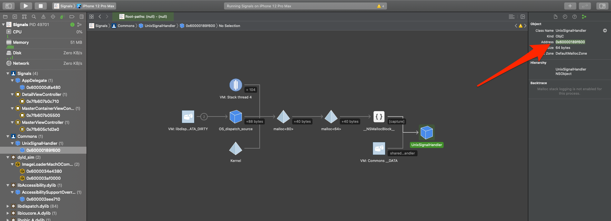
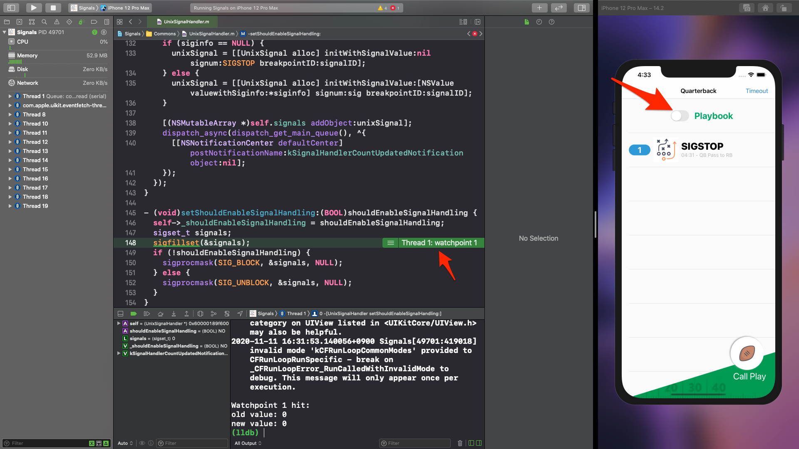
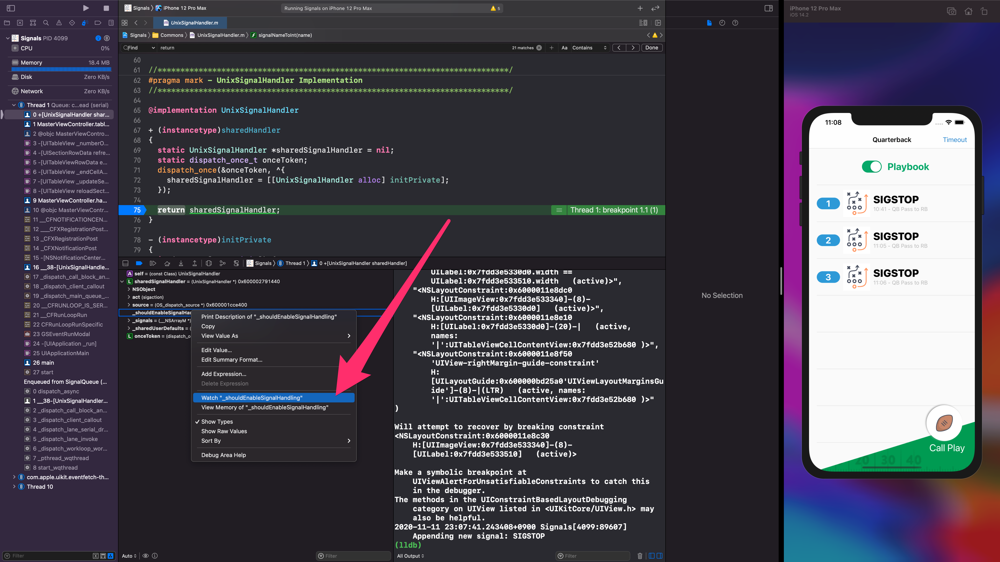

# Chapter 8

breakpoint는 address pointer를 실행할 때를 모니터링 할 수 있지만, 메모리가 읽거나 쓸 때를 모니터링 할 수 없다. Swift object가 heap이 되거나, 특정 메모리 주소를 읽고 있는지를 알 수 없다. 이는 watchpoint로 알 수 있지만, 아키텍쳐 마다 watchpoint가 가능한 메모리 크기가 정해져있다.

watchpoint는 아래와 같은 것들을 할 수 있다.

- allocated된 Swift/Objective-C object의 property를 추적할 수 있다. direct ivar access, Objective-C stter method, Swift property setter method, hardcoded offset access 등등...
- print/printf/NSLog/cout 같은 function call에서 hardcoded string을 모니터링
- assembly instruction을 모니터링

이를 위해서는 property의 offset를 알아내야 한다.

### property의 offset을 찾아내기

```
(lldb) language objc class-table dump UnixSignalHandler -v
isa = 0x107174c28 name = UnixSignalHandler instance size = 56 num ivars = 4 superclass = NSObject
  ivar name = source type = id size = 8 offset = 24
  ivar name = _shouldEnableSignalHandling type = bool size = 1 offset = 32
  ivar name = _signals type = id size = 8 offset = 40
  ivar name = _sharedUserDefaults type = id size = 8 offset = 48
  instance method name = setShouldEnableSignalHandling: type = v20@0:8B16
  instance method name = setSharedUserDefaults: type = v24@0:8@16
  
# 생략...
```

`_shouldEnableSignalHandling`을 보면, offset은 32, size는 1 byte 임을 알 수 있다. 이는 UnixSignalHandler의 메모리 위치 (0x107174c28 아님!)에 32를 더하면 `_shouldEnableSignalHandling`의 위치가 나온다.



UnixSignalHandler의 메모리 위치는 0x0000600002791440 이므로

```
(lldb) p/x 0x0000600002791440 + 32
(long) $0 = 0x0000600002791460
```

0x0000600002791460이 `_shouldEnableSignalHandling`의 주소임을 알 수 있다. 이제 이 ivar를 watchpoint 해보자.

```
(lldb) watchpoint set expression -s 1 -w write -- 0x0000600002791460
Watchpoint created: Watchpoint 1: addr = 0x60000189f620 size = 1 state = enabled type = w
    new value: 0
```

`-s` : size (아까 1 byte라고 했으므로)

`-w` : ivar에 set 할 때만은 `write`. 또는 `read`, `read-write`

그러면 아래 사진처럼 해당 ivar에 set을 할 때 watchpoint가 발동한다!



## disassemble

현재 frame을 disassemble. `-m` 옵션으로 소스코드와 섞어서 볼 수 있다.

```
(lldb) disassemble -F intel -m

** 145 	- (void)setShouldEnableSignalHandling:(BOOL)shouldEnableSignalHandling {

Commons`-[UnixSignalHandler setShouldEnableSignalHandling:]:
    0x10135b4b0 <+0>:   push   rbp
    0x10135b4b1 <+1>:   mov    rbp, rsp
    0x10135b4b4 <+4>:   sub    rsp, 0x20
    0x10135b4b8 <+8>:   mov    qword ptr [rbp - 0x8], rdi
    0x10135b4bc <+12>:  mov    qword ptr [rbp - 0x10], rsi
    0x10135b4c0 <+16>:  and    dl, 0x1
    0x10135b4c3 <+19>:  mov    byte ptr [rbp - 0x11], dl

** 146 	  self->_shouldEnableSignalHandling = shouldEnableSignalHandling;
   147 	  sigset_t signals;

    0x10135b4c6 <+22>:  mov    al, byte ptr [rbp - 0x11]
    0x10135b4c9 <+25>:  mov    rcx, qword ptr [rbp - 0x8]
    0x10135b4cd <+29>:  and    al, 0x1
    0x10135b4cf <+31>:  mov    byte ptr [rcx + 0x20], al

-> 148 	  sigfillset(&signals);

->  0x10135b4d2 <+34>:  mov    dword ptr [rbp - 0x18], 0xffffffff

** 149 	  if (!shouldEnableSignalHandling) {

    0x10135b4d9 <+41>:  test   byte ptr [rbp - 0x11], 0x1
    0x10135b4dd <+45>:  jne    0x10135b4fa               ; <+74> at UnixSignalHandler.m

   1   	/// Copyright (c) 2018 Razeware LLC
   1   	/// Copyright (c) 2018 Razeware LLC
   2   	///

    0x10135b4e3 <+51>:  xor    eax, eax
    0x10135b4e5 <+53>:  mov    edx, eax

** 150 	    sigprocmask(SIG_BLOCK, &signals, NULL);

    0x10135b4e7 <+55>:  mov    edi, 0x1
    0x10135b4ec <+60>:  lea    rsi, [rbp - 0x18]
    0x10135b4f0 <+64>:  call   0x10135ffc6               ; symbol stub for: sigprocmask

** 151 	  } else {

    0x10135b4f5 <+69>:  jmp    0x10135b50c               ; <+92> at UnixSignalHandler.m:154:1

   1   	/// Copyright (c) 2018 Razeware LLC

    0x10135b4fa <+74>:  xor    eax, eax
    0x10135b4fc <+76>:  mov    edx, eax

** 152 	    sigprocmask(SIG_UNBLOCK, &signals, NULL);
   153 	  }

    0x10135b4fe <+78>:  mov    edi, 0x2
    0x10135b503 <+83>:  lea    rsi, [rbp - 0x18]
    0x10135b507 <+87>:  call   0x10135ffc6               ; symbol stub for: sigprocmask

** 154 	}
   155 	
   156 	@end

    0x10135b50c <+92>:  add    rsp, 0x20
    0x10135b510 <+96>:  pop    rbp
    0x10135b511 <+97>:  ret    
    0x10135b512 <+98>:  nop    word ptr cs:[rax + rax]
    0x10135b51c <+108>: nop    dword ptr [rax]
```

여기서 `0x10135b4cf <+31>:  mov    byte ptr [rcx + 0x20], al`라는게 있는데, 이거는 아래 코드랑 같은거라고 한다. 이런건 나중에 배운다고 함.

```objective-c
*(BOOL *)(rcx + 0x20) = al
```

또한 아래 명령어를 입력해서 아까 watchpoint를 생성한 주소가 나온다고 한다. `watchpoint list`를 치면 똑같은 주소가 나온다!

```
(lldb) p/x $rcx + 0x20
(unsigned long) $2 = 0x0000600002791460

(lldb) watchpoint list
Number of supported hardware watchpoints: 4
Current watchpoints:
Watchpoint 1: addr = 0x600002791460 size = 1 state = enabled type = w
    old value: 0
    new value: 0
```

하지만 저 주소는 `_shouldEnableSignalHandling`의 주소, 다시 말해 원래 `UnixSignalHandler`의 주소에 32만큼의 offset을 더해준 주소이므로, 32를 빼면 원래 `UnixSignalHandler`의 주소가 나온다.

```
(lldb) p/x $rcx + 0x20 - 32
(unsigned long) $11 = 0x0000600002791440
```

## watchpoint 삭제

```
(lldb) watchpoint delete
About to delete all watchpoints, do you want to do that?: [Y/n] y
All watchpoints removed. (1 watchpoints)
```

## GUI에서 watchpoint 설정



## watchpoint 관리

breakpoint랑 비슷하게 delete, disable, enable, list, modify, command가 가능하다.

### list

`-b`는 brief의 약자

```
(lldb) watchpoint list -b
Number of supported hardware watchpoints: 4
Current watchpoints:
Watchpoint 2: addr = 0x600002791460 size = 1 state = enabled type = w

(lldb) watchpoint list
Number of supported hardware watchpoints: 4
Current watchpoints:
Watchpoint 2: addr = 0x600002791460 size = 1 state = enabled type = w
    declare @ '/Users/pook/Desktop/Apple_Debugging_and_Reverse_Engineering_v3.0/8-Watchpoints/starter/Signals/Commons/UnixSignalHandler.m:69'
    watchpoint spec = 'sharedSignalHandler->_shouldEnableSignalHandling'
    old value: true
    new value: false
```

### modify

2번의 watchpoint에 condition을 추가할 수 있다. 아래는 `_shouldEnableSignalHandling` (0x600002791460)이 false (0) 일 때만 watchpoint가 걸리도록 condition을 설정한다.

```
(lldb) watchpoint modify 2 -c '*(BOOL*)0x600002791460 == 0'
1 watchpoints modified.
```

모든 condition을 지우려면 아래 코드를 실행하자.

```
(lldb) watchpoint modify 2
1 watchpoints modified.
```

### command

add로 명령어를 더할 수 있다. 아래 코드는 backtrace를 5개 보여지고 process를 continue하는 걸로 명령어 실행을 마친다.

```
(lldb) watchpoint command add 2
Enter your debugger command(s).  Type 'DONE' to end.
> bt 5
> continue
> DONE
```

watchpoint가 걸리면 설정한 명령어가 실행된다.

```
* thread #1, queue = 'com.apple.main-thread', stop reason = watchpoint 2
  * frame #0: 0x000000010135b4d2 Commons`-[UnixSignalHandler setShouldEnableSignalHandling:](self=0x0000600002791440, _cmd="setShouldEnableSignalHandling:", shouldEnableSignalHandling=NO) at UnixSignalHandler.m:148:3
    frame #1: 0x00000001010c82b4 Signals`MasterViewController.breakpointsEnableToggleTapped(sender=0x00007fdd3e408cf0, self=0x00007fdd3e712730) at MasterViewController.swift:124:59
    frame #2: 0x00000001010c86f4 Signals`@objc MasterViewController.breakpointsEnableToggleTapped(_:) at <compiler-generated>:0
    frame #3: 0x00007fff2467b62e UIKitCore`-[UIApplication sendAction:to:from:forEvent:] + 83
    frame #4: 0x00007fff23fa496c UIKitCore`-[UIControl sendAction:to:forEvent:] + 223

Process 4099 resuming

Command #2 'continue' continued the target.
```

설정한 명령어를 지울려면 delete를 쓰자.

```
(lldb) watchpoint command delete 2
```

